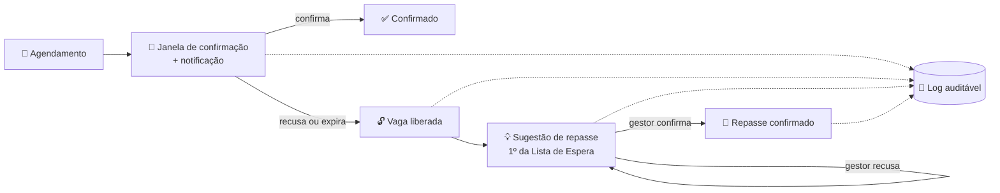
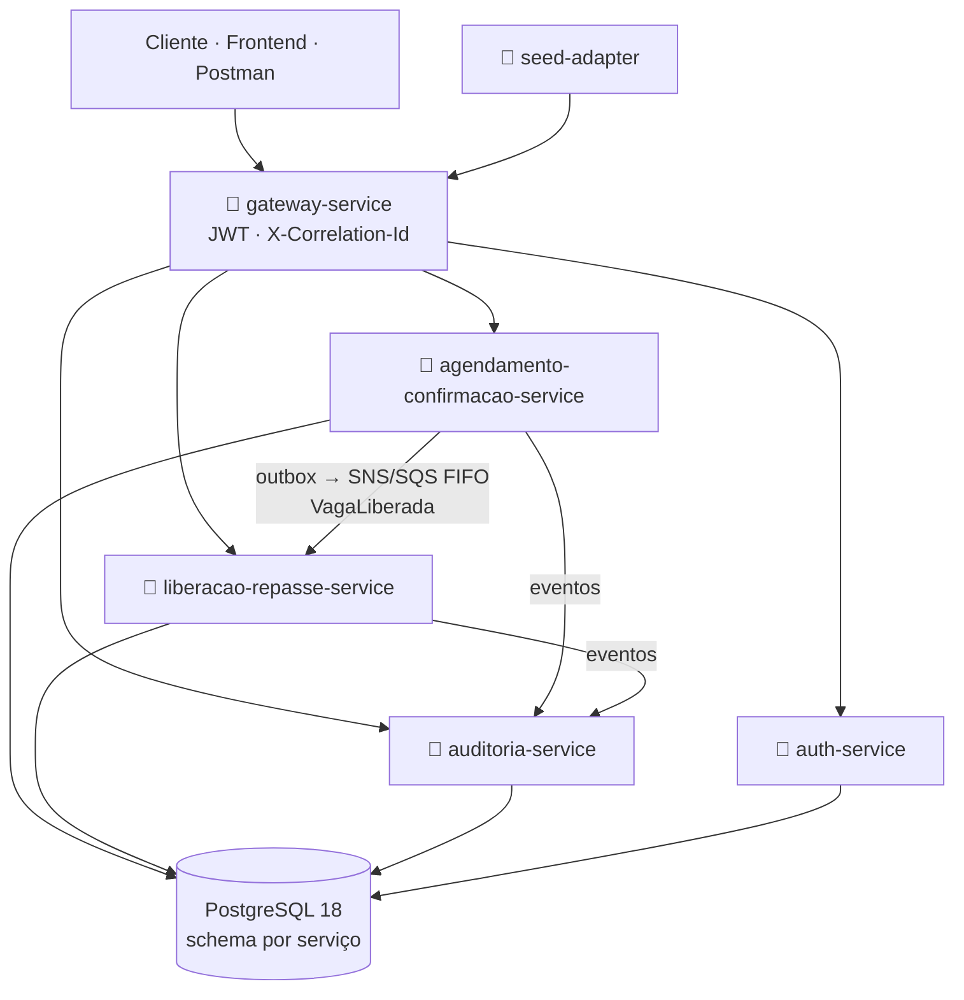

<div align="center">

# 🏥 ConfirmaSUS

### Confirmação ativa de consultas e exames do SUS — a vaga que ia ficar vazia vira uma chance para quem espera


**Hackathon FIAP Pós-Tech · Arquitetura e Desenvolvimento Java · Fase 5**
*Tema: Inovação para otimização de atendimento no SUS*

[📄 Relatório](docs/relatorio-projeto.md) · [🎬 Roteiro do pitch](docs/roteiro-video-pitch.md) · [🎥 Roteiro da demo](docs/roteiro-video-mvp.md) · [🐳 Rodar local](DOCKER_COMPOSE_README.md) · [🧭 Arquitetura](_bmad-output/planning-artifacts/architecture/architecture-Fase5-2026-09-17/ARCHITECTURE-SPINE.md)

</div>

---

## 💡 A ideia

No SUS, cerca de **1 em cada 4** consultas e exames marcados tem o paciente ausente. Numa única região metropolitana (ES), isso custou **R$ 18,5 milhões em 3 anos**. Lembretes por WhatsApp ajudam, mas deixam o ciclo aberto: a vaga que ficou livre continua ociosa.

O **ConfirmaSUS** fecha esse ciclo:



> ⚖️ **Decisão humana, por lei.** Nenhuma decisão clínica é automatizada. A Lista de Espera é ordenada **apenas por ordem de chegada** (nunca por gravidade ou qualquer critério clínico) e todo repasse exige a confirmação de um gestor de agenda.

## ✨ O que o MVP faz

| | Capacidade |
|---|---|
| 🔔 | Abre a janela de confirmação e notifica o paciente (canal simulado) |
| ✅ | Confirmação de presença **idempotente** e recusa ativa com liberação imediata da vaga |
| ⏱️ | Expiração automática da janela, sem intervenção manual |
| 📋 | Lista de Espera FIFO pura e sugestão automática de repasse |
| 🧑‍⚖️ | Gestor confirma ou recusa o repasse; a recusa gera a próxima sugestão |
| 📜 | Log auditável *append-only*, com motivo e horário, consultável por paciente ou agendamento |
| 🔐 | JWT (HS256) emitido pelo `auth-service` e validado no gateway |
| 🖥️ | Frontend React de demonstração: confirmação, dashboard, repasse e auditoria |

## 🏗️ Arquitetura



| Serviço | Responsabilidade |
|---|---|
| 🚪 **`gateway-service`** | Spring Cloud Gateway. Único ponto de entrada; valida JWT em toda rota fora da allowlist pública (`/actuator/health`, `/v1/auth/login`) e gera/propaga o `X-Correlation-Id` (UUID) |
| 🔑 **`auth-service`** | Emite JWT HS256 via `POST /v1/auth/login`, contra usuários sintéticos pré-cadastrados (schema `auth` próprio) |
| 📅 **`agendamento-confirmacao-service`** | Dono de `Paciente`, `Agendamento` e Janela de Confirmação: confirmação, recusa, expiração e liberação de vaga |
| 🔄 **`liberacao-repasse-service`** | Dono de `Recurso`, `Lista de Espera` e `Alocação`: sugestão de repasse FIFO e confirmação/recusa pelo gestor |
| 📜 **`auditoria-service`** | Log auditável: só leitura mais consumidor de eventos dos dois serviços acima |
| 🌱 **`seed-adapter`** | CLI Java standalone (não é Quarkus/Lambda) que carrega dados sintéticos via gateway |
| ☁️ **`infra-cdk`** | AWS CDK (Java): VPC, cluster ECS Fargate, Postgres 18 containerizado e serviços de domínio |
| 🖥️ **`frontend/`** | SPA React/TypeScript com 4 jornadas. Não estava no escopo do PRD (backend-only); foi feita como demonstração |

**Princípios de projeto**

- 🧱 Clean Architecture por serviço e CQRS lógico
- 📮 Eventos via *Outbox* transacional + SNS/SQS FIFO com DLQ
- 🔒 Transição de estado por escrita condicional (`UPDATE … WHERE status = …`), segura mesmo com várias instâncias
- 🛡️ CPF validado por checksum; eventos, auditoria e respostas da API carregam apenas `pacienteId`
- 🗄️ Um schema Postgres por serviço, com `REVOKE` cross-schema

<details>
<summary>ℹ️ Notas de nomenclatura (legado mantido de propósito)</summary>

`liberacao-repasse-service` foi renomeado de `matching-alocacao-service` (módulo Maven, diretório, imagem Docker, CDK e CI). Permanecem com o nome legado: o pacote Java `com.confirmasus.matching`, o schema Postgres `matching_alocacao` (renomear exigiria migração de dados), os prefixos de env `CONFIRMASUS_MATCHING_*` e o tópico SNS `matching-alocacao-eventos.fifo` (contrato entre serviços).

O antigo `triagem-score-service` (produto anterior, que calculava Score de Prioridade Clínica) foi decomissionado por restrição legal, sem substituto, e removido do repositório.

</details>

## 🚀 Começando

### Pré-requisitos

| Ferramenta | Versão | Uso |
|---|---|---|
| [Docker](https://docs.docker.com/get-docker/) | daemon ativo | imagens via `cdk deploy` (AWS) ou `docker-compose` (local) |
| [Java (JDK)](https://adoptium.net/) | 25 | build Maven de todos os módulos |
| [Maven](https://maven.apache.org/) | 3.9+ | build/test do reactor |
| [AWS CLI v2](https://docs.aws.amazon.com/cli/latest/userguide/getting-started-install.html) | configurado (`aws configure`) | deploy/pause/destroy e smoke test (só caminho AWS) |
| [Node.js](https://nodejs.org/) + [AWS CDK CLI](https://docs.aws.amazon.com/cdk/v2/guide/getting_started.html) | compatível com `aws-cdk-lib` 2.268.0 | `cdk deploy` / `destroy` / `synth` |
| [`jq`](https://jqlang.org/) | qualquer recente | parse do `cdk-outputs.json` nos scripts |

Os scripts (`deploy.sh`, `pause.sh`, `destroy.sh`, `scripts/smoke-test.sh`) rodam a partir da raiz do repositório e assumem essas ferramentas no `PATH`.

### 🐳 Rodar localmente (docker-compose, sem AWS)

Caminho recomendado para desenvolvimento e demo. O passo a passo completo (build, seed, troubleshooting) está em [DOCKER_COMPOSE_README.md](DOCKER_COMPOSE_README.md).

```bash
docker-compose build
docker-compose up
```

Com a stack de pé, popule dados de demonstração legíveis (recursos com nome, agendamentos em vários estados e cenários de repasse):

```bash
python3 scripts/seed-demo.py
```

| O quê | Onde |
|---|---|
| Frontend | http://localhost:3000 |
| Swagger UI | http://localhost:8088 |
| Gateway | http://localhost:8080 |
| Login de demo | `admin-tecnico` / `senha-tecnica-segura` |

> ⚠️ O `seed-demo.py` **zera os dados de negócio** e purga as filas antes de recriar tudo. Use só em ambiente local.

### 📖 API: Swagger e Postman

- **Swagger UI:** http://localhost:8088 (sobe com o `docker-compose`, lê [`docs/api/openapi.yaml`](docs/api/openapi.yaml)). Faça login em `POST /v1/auth/login` e clique em **Authorize**.
- **Postman:** importe [`docs/api/confirmasus.postman_collection.json`](docs/api/confirmasus.postman_collection.json).

### ☁️ Rodar na AWS

> ⚠️ Toda ação abaixo age de fato na conta AWS configurada. Confirme conta e região com `aws sts get-caller-identity` antes de rodar.

```bash
mvn -q test                # 1. Build local (reactor: 6 serviços Spring Boot + infra-cdk)
./deploy.sh                # 2. Sobe tudo (VPC, ECS Fargate, Postgres, serviços) num único comando
./scripts/smoke-test.sh    # 3. Smoke test (health público, bypass negado ao auth-service, login válido/inválido)
./pause.sh                 # 4. Pausa sem destruir dados (tasks ECS a 0; retome com ./deploy.sh)
./destroy.sh               # 5. Destroy completo, sem deixar recurso órfão cobrando
```

Login de exemplo (usuário sintético pré-cadastrado via migration Flyway):

```bash
curl -sS -X POST "http://<IP-PUBLICO-GATEWAY>:8080/v1/auth/login" \
  -H 'Content-Type: application/json' \
  -d '{"username":"regulador","password":"regulador#2026"}'
```

O `deploy.sh` imprime o IP público do `gateway-service` ao final; se a task ainda não tiver IP, o próprio script mostra o comando AWS CLI para consultar.

> ℹ️ O CDK descreve a stack completa: Postgres, os **5 serviços** (gateway, auth, agendamento-confirmacao, liberacao-repasse e auditoria), tópicos SNS FIFO e filas SQS FIFO com DLQ. Ele é validado por testes de síntese (`cdk synth`); o `cdk deploy` completo na conta AWS ainda não foi verificado ao vivo.

## 🧪 Build e testes (sem tocar AWS)

```bash
mvn -q test                     # reactor: 6 serviços Spring Boot, com Testcontainers
cd seed-adapter && mvn -q test  # seed-adapter fica fora do reactor (build/runtime próprio)
cd infra-cdk && cdk synth       # valida a stack CDK sem deployar
```

O CI (GitHub Actions, `.github/workflows/ci.yml`) roda esses comandos em todo push/PR que toque algum serviço.

## 🖥️ Frontend

SPA React/TypeScript em `frontend/`. Veja [frontend/README.md](frontend/README.md) e [frontend/ARCHITECTURE.md](frontend/ARCHITECTURE.md).

## 📚 Documentação (método BMAD)

O projeto seguiu o **BMAD**: **Brief → PRD → Architecture → Epics/Stories → Build**, com contrato fechado a cada fase.

| Fase | Artefato |
|---|---|
| 📝 Brief | [`brief.md`](_bmad-output/planning-artifacts/briefs/brief-Fase5-2026-09-16/brief.md) e [`addendum.md`](_bmad-output/planning-artifacts/briefs/brief-Fase5-2026-09-16/addendum.md) (fontes da pesquisa) |
| 📋 PRD | [`prd.md`](_bmad-output/planning-artifacts/prds/prd-Fase5-2026-09-16/prd.md) (14 FRs, 6 NFRs) |
| 🧭 Arquitetura | [`ARCHITECTURE-SPINE.md`](_bmad-output/planning-artifacts/architecture/architecture-Fase5-2026-09-17/ARCHITECTURE-SPINE.md) (13 decisões, AD-1 a AD-13) |
| 🧩 Épicos | [`epics.md`](_bmad-output/planning-artifacts/epics.md) |
| 🛠️ Build | specs por story, `sprint-status.yaml`, `deferred-work.md` e retrospectivas em [`implementation-artifacts/`](_bmad-output/implementation-artifacts/) |

### 🏁 Entrega do hackathon

- 📄 [Relatório do projeto](docs/relatorio-projeto.md) (também em [.docx](docs/relatorio-projeto.docx))
- 📝 [Documento de entrega (.txt)](docs/entrega-hackathon.txt)
- 📖 [OpenAPI](docs/api/openapi.yaml) e [coleção Postman](docs/api/confirmasus.postman_collection.json)
- 🎬 [Roteiro do vídeo de pitch](docs/roteiro-video-pitch.md)
- 🎥 [Roteiro do vídeo do MVP](docs/roteiro-video-mvp.md)
- 📎 [Enunciado do hackathon](docs/Hackaton-9ADJT.pdf)

---

<div align="center">

Feito por **Thiago Henrique Alves Ferreira** · RM369442 · turma 11ADJT

</div>
