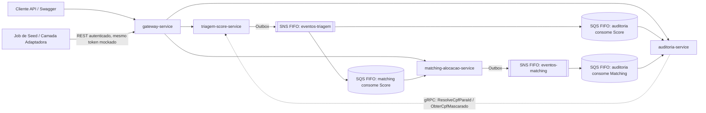
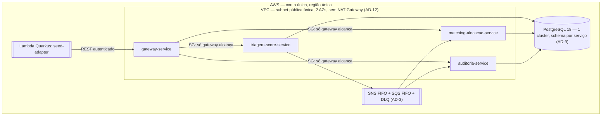
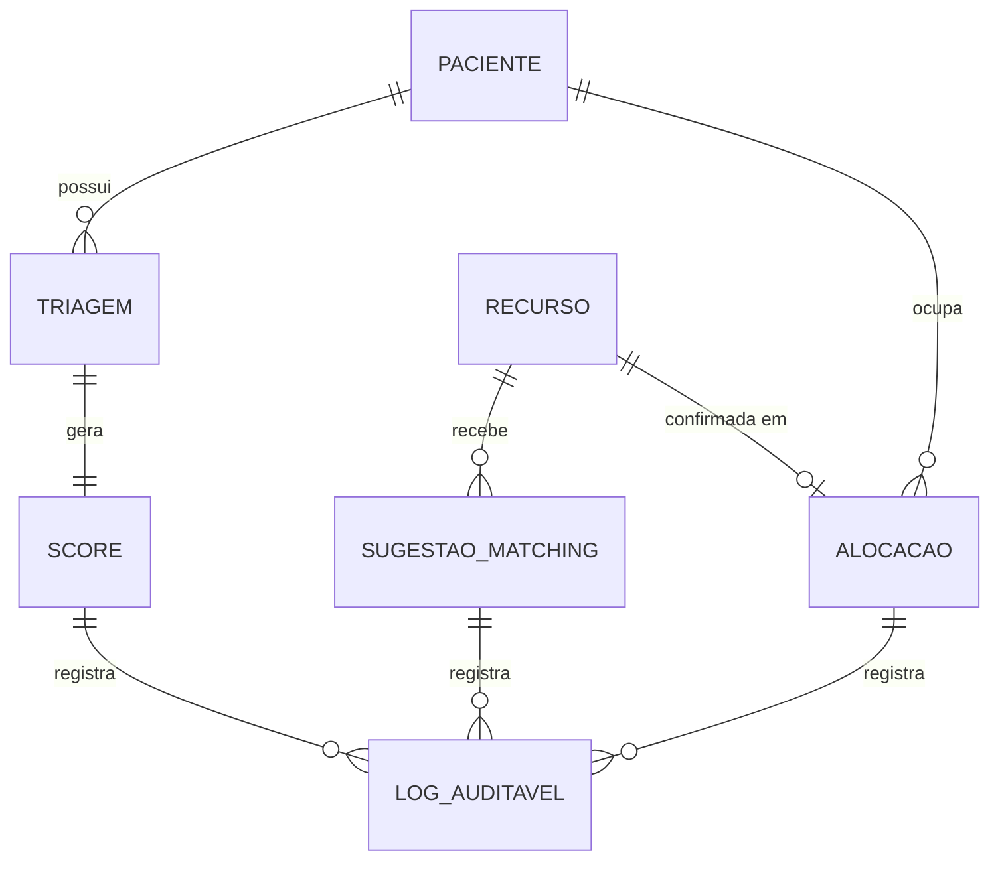

# Architecture Spine — FilaJusta

## Design Paradigm

Microsserviços, um por bounded context. Os contextos foram herdados da decomposição de Features já feita pelo PRD e validados com uma passagem leve de Event Storming (Fast path) sobre os eventos de domínio candidatos — não uma sessão completa de workshop. Dos 4 contextos "prováveis" do addendum (Triagem/Score, Matching/Alocação, Auditoria/Log de Fila, Ingestão/Adaptador), os 3 primeiros viram serviços de runtime; **Ingestão/Adaptador vira um job (`seed-adapter`), não um serviço**, porque FR-10 é uma carga única disparada no deploy, sem consultas nem ciclo de vida próprio que justifique um serviço sempre no ar.

Dentro de cada serviço de runtime, **Clean Architecture** — `domain/` (sem dependência de framework) → `application/` (casos de uso) → `infrastructure/` (web, gRPC, persistência, mensageria). **CQRS lógico** por serviço: `application/command` e `application/query` são pacotes distintos, sobre o mesmo banco — avaliado por serviço (addendum) e decidido igual nos três: o volume do MVP (dezenas de registros) não justifica um read-model dedicado. Se o dataset crescesse para produção real, `matching-alocacao-service` seria o primeiro candidato a CQRS físico (a fila é lida com ordens de magnitude mais frequência do que é escrita).

**Java/framework por componente:** os 3 serviços de runtime + gateway usam Spring Boot/Spring Cloud — o "salto de complexidade" para microsserviços de verdade é um objetivo pedagógico explícito do addendum, então Quarkus não entra nos serviços de domínio. `seed-adapter`, por ser uma função Lambda one-shot, usa **Quarkus** (precedente da Fase 4: cold-start otimizado para Lambda) — a única mistura de runtime do projeto, e deliberada.



## Invariants & Rules

### AD-1 — Bounded contexts e propriedade de dados

- **Binds:** all
- **Prevents:** dois serviços possuindo/mutando a mesma entidade; um serviço lendo/escrevendo direto na base de outro; um cliente contornando o gateway.
- **Rule:** três serviços de runtime — `triagem-score-service` (Paciente, Triagem, Score), `matching-alocacao-service` (Recurso, Sugestão de Matching, Alocação, Prioridade Efetiva), `auditoria-service` (Log Auditável — só leitura + consumidor de eventos). `seed-adapter` (job Lambda, Quarkus) é um cliente comum: entra pelo `gateway-service` com o mesmo token mockado de qualquer outro cliente (FR-11), nunca chama `triagem-score-service`/`matching-alocacao-service` direto. Qualquer dado de outro contexto só é obtido via API pública (pelo gateway), evento de domínio ou gRPC — nunca acesso direto a schema alheio.

### AD-2 — CQRS lógico e Clean Architecture por serviço

- **Binds:** all
- **Prevents:** lógica de domínio acoplada a Spring/JPA/gRPC; comandos e consultas emaranhados de forma que não fique óbvio onde adicionar um novo caso de uso.
- **Rule:** `domain/` nunca importa framework. `application/command/*` muta estado e emite evento; `application/query/*` só lê. Mesmo banco, sem store de leitura separado (ver Design Paradigm para a justificativa por serviço).

### AD-3 — Propagação assíncrona de eventos de domínio (Outbox + SNS/SQS FIFO)

- **Binds:** FR-3, FR-8, NFR Continuidade sob falha parcial
- **Prevents:** a resposta da Triagem bloqueando por indisponibilidade de Matching/Auditoria; perda de evento se um consumidor estiver fora do ar; reentrega criando um novo `eventId` para o mesmo fato de negócio.
- **Rule:** todo produtor (`triagem-score-service`, `matching-alocacao-service`) grava o evento numa tabela outbox **na mesma transação local** do comando; o `eventId` é gerado nesse momento (application layer, UUID v4), persistido na linha do outbox, e **nunca regenerado** pelo relay em uma nova tentativa de publicação. Um relay publica em um tópico **SNS FIFO**; cada serviço consumidor tem sua própria fila **SQS FIFO** assinada (fan-out), com `MessageGroupId = pacienteId` (eventos de Score) ou `recursoId` (eventos de Matching/Alocação/Liberação) para garantir ordem por agregado, e `MessageDeduplicationId = eventId`. Cada fila tem uma DLQ associada (`maxReceiveCount = 5`); mensagens na DLQ são investigadas manualmente, nunca descartadas silenciosamente.

### AD-4 — Prioridade Efetiva e Aging determinísticos

- **Binds:** FR-3, FR-4, FR-7
- **Rule:** `[ASSUMPTION]` Score ∈ `[0, 100]`, calculado, versionado e persistido apenas em `triagem-score-service` (FR-4) — é o único dono e nunca é corrigido por outro serviço. `matching-alocacao-service` mantém uma **réplica local somente-leitura** do Score por Paciente, atualizada por consumo de evento via *upsert idempotente* com resolução **last-write-wins por `occurredAt`** (nunca assume ordem de entrega além da garantida pelo `MessageGroupId` do AD-3). Prioridade Efetiva = `score + min(k × horas_espera, teto)`, `teto = 20` (20% de 100), `k ≈ 1,111 pontos/hora` (teto atingido em 18h, ponto médio da banda 12–24h do PRD) — **sempre computada sob demanda a partir do estado persistido**, nunca cacheada em memória, para que múltiplas instâncias do serviço concordem por construção.
- **Prevents:** dois serviços calculando Score/Aging com fórmulas ou escalas diferentes; réplica ficando obsoleta silenciosamente sob entregas concorrentes/duplicadas.

### AD-5 — Especificidade e desempates de Matching

- **Binds:** FR-5
- **Rule:** `[ASSUMPTION]` cada Recurso tem `especificidadeRank` inteiro atribuído no seed: `1=leito comum, 2=leito UTI, 3=leito UTI especializado, 4=especialista`. Sugestão escolhe, entre Recursos elegíveis para o mesmo Paciente, o de **menor rank suficiente**; em empate de rank, o **ocioso há mais tempo**. Entre Pacientes com Prioridade Efetiva igual para o mesmo Recurso, vence o de Triagem mais antiga (price-time priority); em empate residual de timestamp (ex.: seed em lote), desempate final determinístico por `pacienteId` (ordem lexicográfica).
- **Prevents:** implementações incompatíveis de "mais específico" ou de desempate; um par de registros sem critério de desempate algum (não-determinismo).

### AD-6 — Ciclo de vida do Recurso e Liberação automática

- **Binds:** FR-12, FR-13
- **Rule:** `[ASSUMPTION]` ao confirmar uma Alocação (FR-12), `matching-alocacao-service` publica uma mensagem SQS com delay = duração do atendimento simulado (**minutos de relógio real**, não horas simuladas aceleradas; default 2–5 min por tipo de Recurso). Duração **≤ 15 min** (limite físico do `DelaySeconds` do SQS); um tipo de Recurso que precisasse de mais exigiria encadear mais de uma mensagem de delay — não é o caso do catálogo atual. Ao expirar, o próprio serviço processa a Liberação (FR-13) **seguindo o mesmo padrão outbox do AD-3** (mutação + evento na mesma transação local), recoloca o Recurso no pool com o mesmo `especificidadeRank`, e emite `RecursoLiberado`. O caso de uso `LiberarRecurso` **não é exposto via API REST/gateway** — só é acionado internamente pelo consumidor da fila de delay; não existe endpoint de liberação manual (Non-Goal FR-13).
- **Prevents:** liberação dependente de infraestrutura externa de agendamento ou de ação manual; liberação sem evento de auditoria correspondente se o processo cair entre a mutação e a publicação.

### AD-7 — Fronteira do CPF e de dados identificadores (LGPD by design)

- **Binds:** FR-2, FR-9, §8 Constraints do PRD
- **Rule:** CPF em texto claro só existe em `triagem-score-service` (agregado Paciente). Os únicos meios de outro serviço obter algo derivado do CPF são dois endpoints gRPC internos e exclusivos: `ResolveCpfParaId(cpf) -> pacienteId` (usado só na ingestão, FR-1/FR-2) e `ObterCpfMascarado(pacienteId) -> cpfMascarado` (usado só por `auditoria-service` ao responder FR-9 por CPF). **Nenhum outro atributo de identificação direta do Paciente (nome, endereço, contato) sai de `triagem-score-service`** em evento de domínio ou é persistido em outro serviço — eventos e réplicas carregam somente `pacienteId`. `[ASSUMPTION]` máscara: mantém os 3 primeiros dígitos e os 2 dígitos verificadores, mascara os dois blocos do meio por inteiro — `123.***.***-09`.
- **Prevents:** CPF ou qualquer outro dado pessoal direto vazando para eventos de domínio, Log Auditável, ou qualquer serviço além do de ingestão — inclusive via um campo aparentemente inofensivo adicionado "para a UI".

### AD-8 — Autenticação no Gateway

- **Binds:** FR-11
- **Rule:** `gateway-service` (Spring Cloud Gateway) é o único ponto que valida o token mockado (bearer estático) contra endpoints protegidos, para qualquer cliente incluindo `seed-adapter` (AD-1); health-check é público. Chamadas internas (gRPC, consumo de fila) não passam pelo gateway — rede de confiança, isolada por security group (AD-12), sem RBAC (postura consciente herdada do PRD).
- **Prevents:** cada serviço reimplementando checagem de token de forma divergente; um cliente externo acessando um serviço de domínio pulando o gateway.

### AD-9 — Isolamento por schema num único cluster Postgres

- **Binds:** all (persistência)
- **Rule:** um único cluster PostgreSQL 18; cada serviço tem schema e usuário de banco próprios (`triagem_score`, `matching_alocacao`, `auditoria`), com `REVOKE` explícito de qualquer grant cross-schema — o isolamento é reforçado por permissão de banco, não só por convenção. Migrations versionadas por serviço; um lint de CI varre o código à procura de queries/JPA que referenciem schema alheio. Nenhuma query cross-schema é permitida.
- **Prevents:** acoplamento de banco entre serviços que a separação em microsserviços deveria eliminar; um desenvolvedor violando o isolamento "sem querer" por falta de barreira mecânica; decisão também de custo (evita N instâncias RDS).

### AD-10 — Entrega e idempotência do Log Auditável

- **Binds:** FR-8, FR-9
- **Rule:** `auditoria-service` é append-only; cada registro guarda o `eventId` de origem (mesmo usado como `MessageDeduplicationId`, AD-3) como chave de deduplicação. Reentregas do SQS nunca duplicam uma decisão já registrada. Um `SugestaoGerada` só é registrado quando o Paciente sugerido para aquele Recurso **muda** em relação ao último registro para o mesmo `recursoId` — não a cada recálculo/consulta (FR-6 recalcula a cada `GET`, o que não é, por si só, uma nova decisão a auditar).
- **Prevents:** registros de auditoria duplicados ou perdidos sob reentrega/falha parcial; inundação do Log Auditável por polling de leitura, ou perda de decisões reais por under-logging.

### AD-11 — Faixas fisiológicas plausíveis da Triagem

- **Binds:** FR-1
- **Rule:** `[ASSUMPTION]` limites de plausibilidade (não diagnósticos clínicos) para rejeição com `400`: FC 40–200 bpm, PAS 60–260 mmHg, PAD 30–150 mmHg, SpO2 50–100%, FR 5–60 irpm, Temp 30–42°C.
- **Prevents:** cada implementação de validação de sinais vitais inventando limites próprios e incompatíveis.

### AD-12 — Topologia de rede e isolamento

- **Binds:** all (envelope operacional)
- **Rule:** VPC com **subnet pública única** (2 AZs, sem subnets privadas e sem NAT Gateway — custo). Todas as tasks ECS Fargate (`gateway-service`, `triagem-score-service`, `matching-alocacao-service`, `auditoria-service`) rodam na subnet pública; o isolamento entre elas é feito por **security group**, não por camada de rede: apenas o security group do `gateway-service` pode alcançar as portas HTTP dos demais serviços; gRPC entre `auditoria-service` e `triagem-score-service` é liberado explicitamente entre seus dois security groups; nenhum outro tráfego lateral é permitido.
- **Prevents:** um cliente externo ou um serviço não autorizado acessando um serviço de domínio diretamente, contornando o gateway (AD-8); custo de NAT Gateway 24/7 (vetado no PRD §8/addendum).

## Consistency Conventions

| Concern | Convention |
| --- | --- |
| Naming (entidades, eventos, interfaces) | Eventos de domínio em PascalCase no passado (`ScoreCalculado`, `AlocacaoConfirmada`, `RecursoLiberado`); IDs internos = UUID v4 (`pacienteId`, `recursoId`, `alocacaoId`); CPF nunca é chave fora de `triagem-score-service`. |
| Data & formats (ids, datas, erros, envelope) | Datas em ISO-8601 UTC; envelope de evento = `{eventId, eventType, occurredAt, version, correlationId, payload}`; cada `eventType` tem um schema companion (JSON Schema) versionado junto ao código do produtor, referenciado na Capability → Architecture Map; erros de API seguem RFC 7807 Problem Details; contratos REST/proto/evento versionados (`/v1/`, pacote proto `vN`). |
| State & cross-cutting (mutação, log, config, auth) | Mutação só via comando do serviço dono, sempre outbox na mesma transação (AD-3/AD-6); logging estruturado em JSON; segredos via variável de ambiente/AWS Secrets Manager, nunca no repositório; config não-sensível centralizada via Spring Cloud Config; auth só no gateway (AD-8), isolamento de rede via security group (AD-12). |
| Observabilidade | Cada serviço expõe health-check público (`/actuator/health`), fora da autenticação do gateway; `gateway-service` gera um `correlationId` (UUID) por requisição, propagado em header HTTP e no envelope de evento (campo `correlationId`), permitindo rastrear uma decisão ponta a ponta nos logs estruturados sem exigir tracing distribuído completo. |

## Stack

`[ASSUMPTION]` Versões verificadas via web em 2026-09-06; dado o ritmo de releases das linhas Spring Boot 4.x / Spring Cloud, reconfirmar antes do primeiro build.

| Name | Version |
| --- | --- |
| Java | 25 (LTS) |
| Spring Boot | 4.1.1 — `gateway-service`, `triagem-score-service`, `matching-alocacao-service`, `auditoria-service` |
| Spring Cloud | 2025.1.2+ ("Oakwood", compatível com Spring Boot 4.1.x) — Gateway, Config, Netflix Eureka (discovery) |
| gRPC | suporte gRPC nativo do Spring Boot 4.1 (Spring gRPC 1.1.0 integrado); starter standalone `org.springframework.grpc` 1.0.x como alternativa se o suporte integrado não se aplicar |
| Quarkus | `seed-adapter` (job Lambda) — precedente Fase 4, cold-start otimizado |
| PostgreSQL | 18 (estável; nenhuma versão mais nova estável a superou em set/2026) |
| AWS SNS + SQS (FIFO) | mensageria assíncrona (Outbox/fan-out, AD-3) |
| AWS ECS Fargate | hospedagem dos serviços, escalável a 0 |
| AWS Lambda | `seed-adapter` |
| Cucumber-JVM | aceitação BDD ponta a ponta (PRD §7) |
| JaCoCo + PIT | cobertura de linha ≥90% e mutação na camada de domínio (PRD §7) |

## Structural Seed





```text
fila-justa/
  gateway-service/                # Spring Cloud Gateway — único ponto de auth (AD-8)
  triagem-score-service/
    domain/                       # Paciente, Triagem, Score — sem dependência de framework
    application/
      command/                    # RegistrarTriagem, ResolverOuCriarPaciente
      query/                      # ConsultarTriagem
    infrastructure/
      web/                        # REST controllers (FR-1, FR-3)
      grpc/                       # ResolveCpfParaId, ObterCpfMascarado (AD-7)
      persistence/                # schema triagem_score
      outbox/                     # publisher para SNS FIFO (AD-3)
    src/main/resources/application.yml   # filajusta.triagem.limites.* (AD-11)
  matching-alocacao-service/
    domain/                       # Recurso, SugestaoMatching, Alocacao, Aging
    application/
      command/                    # ConfirmarAlocacao, RecusarSugestao, LiberarRecurso (interno, não-REST — AD-6)
      query/                      # ConsultarFila, ConsultarSugestao
    infrastructure/
      web/ grpc/ persistence/ outbox/ sqs-consumer/
    src/main/resources/application.yml   # filajusta.aging.{k,teto}, filajusta.liberacao.duracao.* — fonte única (AD-4, AD-6)
  auditoria-service/
    domain/                       # LogAuditavel (append-only)
    application/
      query/                      # ConsultarAuditoriaPaciente, ConsultarAuditoriaRecurso
    infrastructure/
      web/ grpc-client/ persistence/ sqs-consumer/
  seed-adapter/                    # job Lambda (Quarkus) — Camada Adaptadora (FR-10)
  deploy/                          # scripts deploy/pause/destroy (precedente Fase 4)
```

## Capability → Architecture Map

| Capability / Area | Lives in | Governed by |
| --- | --- | --- |
| FR-1 Registro de Triagem | `triagem-score-service` | AD-1, AD-2, AD-11 |
| FR-2 Identificação mínima do Paciente | `triagem-score-service` | AD-1, AD-7 |
| FR-3 Cálculo do Score | `triagem-score-service` | AD-3, AD-4 |
| FR-4 Determinismo do Score | `triagem-score-service` | AD-4 |
| FR-5 Sugestão de Matching | `matching-alocacao-service` | AD-4, AD-5 |
| FR-6 Consulta da fila e sugestões | `matching-alocacao-service` | AD-2, AD-10 |
| FR-7 Aging da Prioridade Efetiva | `matching-alocacao-service` | AD-4 |
| FR-8 Registro de decisão (Log Auditável) | `auditoria-service` | AD-3, AD-10 |
| FR-9 Consulta de auditoria | `auditoria-service` | AD-7, AD-10 |
| FR-10 Carga de dados sintéticos | `seed-adapter` (job) | AD-1, AD-8 |
| FR-11 Autenticação por token mockado | `gateway-service` | AD-8, AD-12 |
| FR-12 Confirmação/recusa da sugestão | `matching-alocacao-service` | AD-1, AD-6 |
| FR-13 Liberação de Recurso | `matching-alocacao-service` | AD-6 |

*Nota: AD-9 (isolamento por schema) e AD-12 (rede) se aplicam a todas as linhas acima e não são repetidos célula a célula.*

## Deferred

- **RBAC por papel** (FR-11) — postura consciente do MVP (qualquer token válido acessa qualquer endpoint); revisitável se a banca exigir isolamento por papel.
- **Conformidade legal plena com a LGPD** (base legal art. 11, retenção/eliminação art. 18, DPO) — fora do escopo deste MVP acadêmico (PRD §8); AD-7 cobre só os princípios de minimização/propagação.
- **Calibração fina** dos valores `[ASSUMPTION]` (AD-4 k/teto, AD-6 duração por tipo de Recurso) — fonte única de verdade em `matching-alocacao-service/src/main/resources/application.yml` (`filajusta.aging.*`, `filajusta.liberacao.duracao.*`); catálogo completo de `especificidadeRank` (AD-5) e faixas fisiológicas (AD-11) similarmente centralizados em config, não espalhados pelo código. Ajustáveis durante epics/stories/build sem violar os ADs, desde que mudem só nesse local.
- **RDS gerenciado vs. Postgres em container no próprio ECS** — decisão de custo fina, cabe a uma story de infraestrutura.
- **Estratégia de migração de schema** (Flyway vs. Liquibase) — detalhe de implementação, não invariante.
- **Alta disponibilidade full-produção** (multi-AZ, failover automático, DR) — fora de escopo por NFR explícito do PRD; redundância fica proporcional ao hackathon.
- **Tracing distribuído completo** (ex.: AWS X-Ray) — o `correlationId` propagado (Consistency Conventions) cobre a necessidade mínima de rastreio do MVP; upgrade para tracing completo fica para depois, se o volume de serviços crescer.
