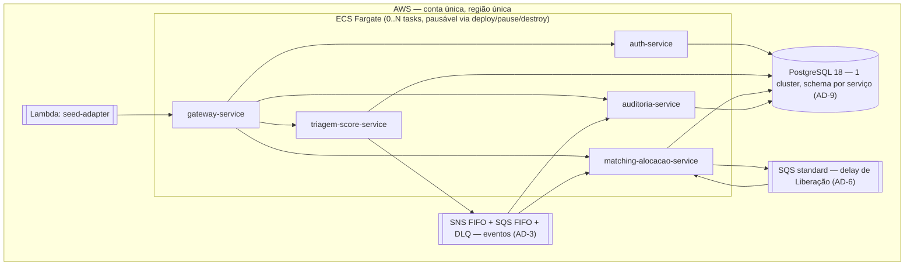
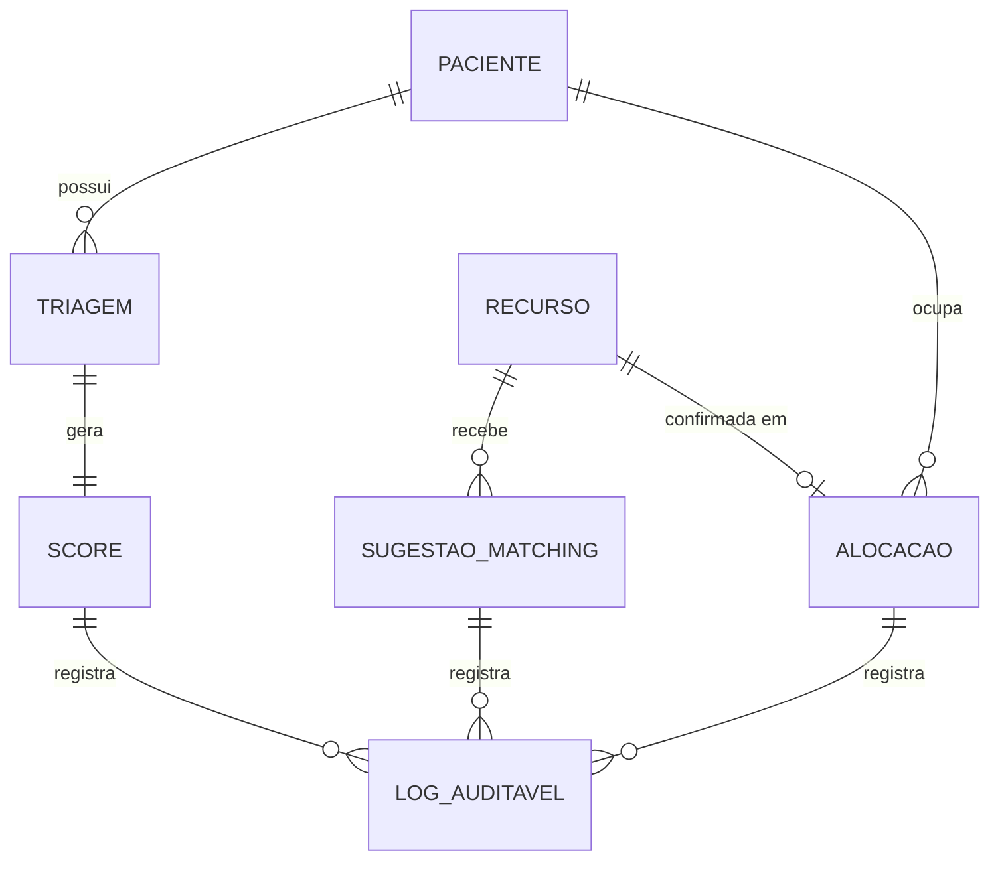

# Architecture Spine — FilaJusta

## Design Paradigm

Microsserviços, um por bounded context. Os contextos foram herdados da decomposição de Features já feita pelo PRD e validados com uma passagem leve de Event Storming (Fast path) sobre os eventos de domínio candidatos — não uma sessão completa de workshop. Dos 4 contextos "prováveis" do addendum (Triagem/Score, Matching/Alocação, Auditoria/Log de Fila, Ingestão/Adaptador), os 3 primeiros viram serviços de runtime; **Ingestão/Adaptador vira um job (`seed-adapter`), não um serviço**, porque FR-10 é uma carga única disparada no deploy, sem consultas nem ciclo de vida próprio que justifique um serviço sempre no ar.

Dentro de cada serviço de runtime, **Clean Architecture** — `domain/` (sem dependência de framework) → `application/` (casos de uso) → `infrastructure/` (web, gRPC, persistência, mensageria). **CQRS lógico** por serviço: regra e justificativa em AD-2. Runtime por componente (Spring Boot vs. Quarkus): AD-13.

A topologia completa de contêineres e a rede que os conecta está em Structural Seed — não repetida aqui.

## Invariants & Rules

### AD-1 — Bounded contexts e propriedade de dados

- **Binds:** all
- **Rule:** três serviços de runtime de domínio — `triagem-score-service` (Paciente, Triagem, Score), `matching-alocacao-service` (Recurso, Sugestão de Matching, Alocação, Prioridade Efetiva), `auditoria-service` (Log Auditável — só leitura + consumidor de eventos) —, mais `auth-service` como serviço de suporte transversal (identidade de usuário sintético, sem dado de domínio clínico; ver AD-14). `seed-adapter` (job Lambda, Quarkus) é um cliente comum: autentica-se contra `auth-service` (AD-14) com um usuário técnico pré-cadastrado para obter seu próprio token, e entra pelo `gateway-service` como qualquer outro cliente (FR-11), nunca chama `triagem-score-service`/`matching-alocacao-service` diretamente. `seed-adapter` faz *upsert* de Recursos por chave natural (`codigoRecurso`), nunca insere às cegas — reexecutar o job após um deploy falho não duplica o catálogo (Pacientes já são idempotentes por CPF, FR-1/FR-2). Qualquer dado de outro contexto só é obtido via API pública (pelo gateway), evento de domínio ou gRPC — nunca acesso direto a schema alheio.
- **Prevents:** dois serviços possuindo/mutando a mesma entidade; um serviço lendo/escrevendo direto na base de outro; um cliente contornando o gateway; um redeploy do seed duplicando o pool de Recursos.

### AD-2 — CQRS lógico e Clean Architecture por serviço

- **Binds:** all
- **Rule:** `domain/` nunca importa framework. `application/command/*` muta estado e emite evento; `application/query/*` só lê. Mesmo banco, sem store de leitura separado — decisão avaliada por serviço (addendum), não aplicada às cegas: o volume do MVP (dezenas de registros) não justifica um read-model dedicado nos três serviços. Se o dataset crescesse para produção real, `matching-alocacao-service` seria o primeiro candidato a CQRS físico, porque a fila é lida com ordens de magnitude mais frequência do que é escrita. Exceção documentada: o rastreamento de "última sugestão registrada por Recurso" (AD-10) não é estado de domínio de Matching — é um dado de apoio à auditoria, mantido pela própria consulta que responde a sugestão e não conta como violação desta regra.
- **Prevents:** lógica de domínio acoplada a Spring/JPA/gRPC; comandos e consultas emaranhados de forma que não fique óbvio onde adicionar um novo caso de uso; complexidade de CQRS físico sem justificativa de escala real.

### AD-3 — Propagação assíncrona de eventos de domínio (Outbox + SNS/SQS FIFO)

- **Binds:** FR-3, FR-8, NFR Continuidade sob falha parcial
- **Rule:** todo produtor (`triagem-score-service`, `matching-alocacao-service`) grava o evento numa tabela outbox na mesma transação local do comando; o `eventId` é gerado nesse momento (application layer, UUID v4), persistido na linha do outbox e nunca regenerado pelo relay em uma nova tentativa de publicação. O relay é um poller periódico que lê linhas outbox pendentes e só as marca publicadas após confirmação do broker — uma republicação após falha de rede não duplica a entrega, porque o `eventId` não muda. O relay publica em um tópico SNS FIFO; cada serviço consumidor tem sua própria fila SQS FIFO assinada (fan-out), com `MessageGroupId = pacienteId` (eventos de Score) ou `recursoId` (eventos de Matching/Alocação/Liberação) para garantir ordem por agregado e `MessageDeduplicationId = eventId`. Cada fila tem uma DLQ associada (`maxReceiveCount = 5`); mensagens na DLQ são investigadas manualmente, nunca descartadas silenciosamente. Este padrão cobre a propagação de eventos de domínio — a fila de delay usada pela Liberação de Recurso (AD-6) é uma fila SQS **standard** separada, porque FIFO não suporta delay por mensagem.
- **Prevents:** a resposta da Triagem bloqueando por indisponibilidade de Matching/Auditoria; perda de evento se um consumidor estiver fora do ar; reentrega criando um `eventId` novo para o mesmo fato de negócio; confusão entre o mecanismo de eventos (FIFO) e o de delay de Liberação (standard) por não estarem distinguidos.

### AD-4 — Prioridade Efetiva e Aging determinísticos

- **Binds:** FR-3, FR-4, FR-7
- **Rule:** `[ASSUMPTION]` Score ∈ `[0, 100]`, calculado, versionado e persistido apenas em `triagem-score-service` (FR-4) — é o único dono e nunca é corrigido por outro serviço. `matching-alocacao-service` mantém uma **réplica local somente-leitura** do Score por Paciente, atualizada por consumo de evento via *upsert idempotente* com resolução **last-write-wins por `occurredAt`**, e por `eventId` (ordem lexicográfica) no raríssimo caso de `occurredAt` empatado (nunca assume ordem de entrega além da garantida pelo `MessageGroupId` do AD-3). Se a réplica estiver vazia num boot a frio (deploy novo, ou após perda de dados — eventos antigos já saíram da retenção do SQS), `matching-alocacao-service` faz uma chamada REST síncrona de bootstrap a um endpoint interno de `triagem-score-service` que lista os Scores atuais, antes de aceitar tráfego de `ConsultarFila`. Um Paciente cuja Triagem acabou de ser registrada e cujo evento ainda não foi consumido simplesmente não aparece em `ConsultarFila` até a réplica ser atualizada — janela de consistência eventual aceita, não um bug a esconder. Prioridade Efetiva = `score + min(k × max(0, horas_espera), teto)` — a espera nunca é negativa mesmo sob defasagem de relógio entre serviços —, `teto = 20` (20% de 100), `k ≈ 1,111 pontos/hora` (teto atingido em 18h, ponto médio da banda 12–24h do PRD) — sempre computada sob demanda a partir do estado persistido, nunca cacheada em memória, para que múltiplas instâncias do serviço concordem por construção.
- **Prevents:** dois serviços calculando Score/Aging com fórmulas ou escalas diferentes; réplica ficando obsoleta silenciosamente sob entregas concorrentes/duplicadas; réplica vazia permanentemente após um redeploy sem caminho de recuperação; Prioridade Efetiva menor que o Score por causa de um `horas_espera` negativo.

### AD-5 — Especificidade e desempates de Matching

- **Binds:** FR-5, FR-12
- **Rule:** `[ASSUMPTION]` cada Recurso tem `especificidadeRank` inteiro atribuído no seed: `1=leito comum, 2=leito UTI, 3=leito UTI especializado, 4=especialista`. Sugestão escolhe, entre Recursos elegíveis para o mesmo Paciente, o de menor rank suficiente; em empate de rank, o ocioso há mais tempo; em empate residual, desempate final determinístico por `recursoId` (ordem lexicográfica). Entre Pacientes com Prioridade Efetiva igual para o mesmo Recurso, vence o de Triagem mais antiga (price-time priority); em empate residual de timestamp (ex.: seed em lote), desempate final por **número de sequência da Triagem** (inteiro monotônico atribuído na criação) — não por `pacienteId` (um UUID sem significado explicaria mal a um auditor por que um Paciente venceu). Uma Recusa (FR-12) exclui o par (`recursoId`, `pacienteId`) de futuras sugestões para aquele mesmo Recurso; o Paciente recusado segue elegível para qualquer outro Recurso compatível (PRD FR-12) — só não é re-sugerido ao Recurso que já recusou.
- **Prevents:** implementações incompatíveis de "mais específico" ou de desempate; um par de Recursos ou de Pacientes sem critério de desempate algum (não-determinismo); um desempate final ilegível para um auditor; resugestão indefinida de um Paciente já recusado para o mesmo Recurso.

### AD-6 — Ciclo de vida do Recurso e Liberação automática

- **Binds:** FR-12, FR-13
- **Rule:** `[ASSUMPTION]` ao confirmar uma Alocação (FR-12), `matching-alocacao-service` grava a Alocação sob uma constraint única de banco em `(recursoId, status=ativa)` — uma segunda confirmação concorrente para o mesmo Recurso falha com `409`, o mesmo tratamento já usado pelo PRD para Paciente duplamente alocado — e publica uma mensagem numa fila **SQS standard dedicada à Liberação** (distinta das filas FIFO de eventos do AD-3, porque FIFO não suporta delay por mensagem) com delay = duração do atendimento simulado (minutos de relógio real, não horas simuladas aceleradas; default 2–5 min por tipo de Recurso), carregando o `correlationId` da confirmação original como atributo da mensagem. Duração ≤ 15 min (limite físico do `DelaySeconds` do SQS); um tipo de Recurso que precisasse de mais exigiria encadear mais de uma mensagem de delay — não é o caso do catálogo atual. Ao expirar, o consumidor processa a Liberação de forma **idempotente por `alocacaoId`** (uma redelivery da mesma mensagem não libera o mesmo Recurso duas vezes nem emite `RecursoLiberado` duplicado), seguindo o mesmo padrão outbox do AD-3 para o evento resultante (mutação + evento na mesma transação local, propagando o `correlationId` recebido — o evento em si, ao contrário da mensagem de delay que o disparou, vai pela fila FIFO de eventos). Recoloca o Recurso no pool com o mesmo `especificidadeRank`. O caso de uso `LiberarRecurso` não é exposto via API REST/gateway — só é acionado internamente pelo consumidor da fila de delay; não existe endpoint de liberação manual (Non-Goal FR-13).
- **Prevents:** liberação dependente de infraestrutura externa de agendamento ou de ação manual; liberação sem evento de auditoria correspondente se o processo cair entre a mutação e a publicação; redelivery da mensagem de delay duplicando a liberação; duas confirmações concorrentes alocando o mesmo Recurso; um `RecursoLiberado` sem `correlationId` que quebre o rastreio ponta a ponta até a Confirmação original.

### AD-7 — Fronteira do CPF e de dados identificadores (LGPD by design)

- **Binds:** FR-1, FR-2, FR-9, §8 Constraints do PRD
- **Rule:** validação de formato/checksum do CPF (FR-1) ocorre em `triagem-score-service` antes de qualquer resolução de ID ou cálculo de Score. CPF em texto claro só existe nesse serviço (agregado Paciente). Os únicos meios de outro serviço obter algo derivado do CPF são dois endpoints gRPC internos e exclusivos: `ResolveCpfParaId(cpf) -> pacienteId` (usado só na ingestão, FR-1/FR-2) e `ObterCpfMascarado(pacienteId) -> cpfMascarado` (usado só por `auditoria-service` ao responder FR-9 por CPF). Além do isolamento de rede (AD-12), os dois endpoints exigem um segredo compartilhado (token de serviço em metadata gRPC) — para o dado mais sensível do sistema, isolamento de rede sozinho não basta. Nenhum outro atributo de identificação direta do Paciente (nome, endereço, contato) sai de `triagem-score-service` em evento de domínio ou é persistido em outro serviço — eventos e réplicas carregam somente `pacienteId`. `[ASSUMPTION]` máscara: mantém os 3 primeiros dígitos e os 2 dígitos verificadores, mascara os dois blocos do meio por inteiro — `123.***.***-09`.
- **Prevents:** CPF ou qualquer outro dado pessoal direto vazando para eventos de domínio, Log Auditável, ou qualquer serviço além do de ingestão — inclusive via um campo aparentemente inofensivo adicionado "para a UI"; qualquer container alcançável pelo security group podendo desmascarar um CPF sem nenhuma outra barreira.

### AD-8 — Autenticação no Gateway

- **Binds:** FR-11
- **Rule:** `gateway-service` (Spring Cloud Gateway) é o único ponto que valida o token emitido por `auth-service` (AD-14) — verifica assinatura e expiração do JWT — contra endpoints protegidos, para qualquer cliente incluindo `seed-adapter` (AD-1); health-check e a rota de login (`POST /v1/auth/login`, AD-14) são públicos através de exceções estreitas e nomeadas de security group (AD-12) — não contradizem o isolamento de rede porque não reabrem nenhuma outra rota. Chamadas internas (gRPC, consumo de fila) não passam pelo gateway — rede de confiança, isolada por security group (AD-12), sem RBAC (postura consciente herdada do PRD).
- **Prevents:** cada serviço reimplementando checagem de token de forma divergente; um cliente externo acessando um serviço de domínio pulando o gateway; health-check ou login público interpretados como uma abertura geral do security group.

### AD-9 — Isolamento por schema num único cluster Postgres

- **Binds:** all (persistência)
- **Rule:** um único cluster PostgreSQL 18; cada serviço tem schema e usuário de banco próprios (`triagem_score`, `matching_alocacao`, `auditoria`, `auth`), com `REVOKE` explícito de qualquer grant cross-schema. Migrations versionadas por serviço; enforcement mecânico via uma regra ArchUnit por módulo de serviço, proibindo entidades/repositórios JPA fora do pacote/schema próprio daquele serviço, rodando como check obrigatório de CI — o isolamento é reforçado por permissão de banco e por CI, não só por convenção. Backup: snapshot automático diário do cluster (retenção mínima de 1–3 dias) — mínimo necessário para não perder tudo com uma migration ruim ou `DELETE` acidental durante o hackathon.
- **Prevents:** acoplamento de banco entre serviços que a separação em microsserviços deveria eliminar; um desenvolvedor violando o isolamento "sem querer" por falta de barreira mecânica; perda total de dados por uma migration ruim ou erro humano sem caminho de recuperação; decisão também de custo (evita N instâncias RDS).

### AD-10 — Entrega e idempotência do Log Auditável

- **Binds:** FR-8, FR-9
- **Rule:** `auditoria-service` é append-only; a mutação que grava cada decisão consumida vive em `application/command` daquele serviço (não em `application/query`, que é somente leitura) — ver Structural Seed. Cada registro guarda o `eventId` de origem (mesmo usado como `MessageDeduplicationId`, AD-3) como chave de deduplicação; reentregas do SQS nunca duplicam uma decisão já registrada. Um `SugestaoGerada` só é registrado quando o Paciente sugerido para aquele Recurso muda em relação ao último registro para o mesmo `recursoId` — não a cada recálculo/consulta (FR-6 recalcula a cada `GET`, o que não é, por si só, uma nova decisão a auditar). Esse rastreamento de "última sugestão registrada por Recurso" é mantido por `matching-alocacao-service` (exceção documentada em AD-2): a própria consulta que responde a sugestão atualiza esse dado de apoio e, ao detectar mudança, publica `SugestaoGerada` via outbox (AD-3).
- **Prevents:** registros de auditoria duplicados ou perdidos sob reentrega/falha parcial; inundação do Log Auditável por polling de leitura, ou perda de decisões reais por under-logging; ambiguidade sobre onde vive a mutação, forçando um dev a escrever dentro de um "query" ou a nunca implementar o dedup.

### AD-11 — Faixas fisiológicas plausíveis da Triagem

- **Binds:** FR-1
- **Rule:** `[ASSUMPTION]` limites de plausibilidade (não diagnósticos clínicos) para rejeição com `400`: FC 40–200 bpm, PAS 60–260 mmHg, PAD 30–150 mmHg, SpO2 50–100%, FR 5–60 irpm, Temp 30–42°C. Todos os sinais obrigatórios devem estar presentes (nenhum campo omitido) e PAS deve ser maior que PAD — qualquer violação causa `400`, antes de qualquer cálculo de Score.
- **Prevents:** cada implementação de validação de sinais vitais inventando limites próprios e incompatíveis; uma Triagem incompleta ou fisiologicamente inconsistente (PAS ≤ PAD) sendo aceita.

### AD-12 — Topologia de rede e isolamento

- **Binds:** all (envelope operacional)
- **Rule:** VPC com subnet pública única (2 AZs, sem NAT Gateway — custo). Tasks ECS Fargate com `assignPublicIp=ENABLED`, alcançando SNS/SQS/ECR pela Internet Gateway — mais simples e barato que VPC endpoints para o volume do MVP. Isolamento entre serviços por security group, não por camada de rede: apenas o security group do `gateway-service` alcança as portas HTTP de aplicação dos demais serviços; adicionalmente, o security group de health-check do load balancer/ECS alcança só a porta de health-check de cada serviço — exceção estreita e nomeada, não uma abertura geral (ver AD-8). gRPC entre `auditoria-service` e `triagem-score-service` é liberado explicitamente entre seus dois security groups; nenhum outro tráfego lateral é permitido.
- **Prevents:** um cliente externo ou um serviço não autorizado acessando um serviço de domínio diretamente, contornando o gateway (AD-8); custo de NAT Gateway 24/7 (vetado no PRD §8/addendum); health-check inalcançável por falta de uma exceção de security group nomeada.

### AD-13 — Runtime por componente (Spring Boot vs. Quarkus)

- **Binds:** all (build/runtime)
- **Rule:** `gateway-service`, `triagem-score-service`, `matching-alocacao-service`, `auditoria-service` e `auth-service` usam Spring Boot/Spring Cloud — o "salto de complexidade" para microsserviços de verdade é um objetivo pedagógico explícito do addendum. `seed-adapter`, por ser uma função Lambda one-shot, usa Quarkus (precedente da Fase 4: cold-start otimizado para Lambda) — a única mistura de runtime do projeto e deliberada.
- **Prevents:** um desenvolvedor introduzindo Quarkus num serviço de domínio "porque já tem no projeto", perdendo a consistência de stack entre os serviços que compõem o sistema principal.

### AD-14 — Emissão de token de autenticação via `auth-service` dedicado

- **Binds:** FR-11
- **Rule:** `[ASSUMPTION]` `auth-service` (Spring Boot, AD-13) tem schema próprio (`auth`, AD-9) com uma tabela de usuários sintéticos pré-cadastrados por migration (Flyway) na inicialização — não via `seed-adapter`/FR-10, que segue restrito a unidades de saúde, leitos e especialistas. Expõe `POST /v1/auth/login` (usuário + senha mockados) e retorna um JWT assinado (HS256, segredo compartilhado com `gateway-service` via variável de ambiente/AWS Secrets Manager — mesmo padrão de segredo compartilhado do AD-7) com um claim de papel (`role`) puramente informativo; nenhum serviço aplica controle de acesso por papel a partir desse claim (Non-Goal do PRD, FR-11). `gateway-service` (AD-8) é quem valida a assinatura e a expiração do JWT — `auth-service` só emite, nunca valida requisições de terceiros. A rota de login é pública através da mesma exceção estreita e nomeada de security group usada para health-check (AD-8/AD-12). `seed-adapter` usa um usuário técnico pré-cadastrado nessa mesma tabela para se autenticar antes de chamar o gateway (AD-1) — substituindo o bearer estático fixo que usava antes desta decisão.
- **Prevents:** um bearer estático fixo em config como única credencial do sistema; um serviço de domínio reimplementando validação de token (mantém AD-8 como único ponto de enforcement); a rota de login vazando para fora do gateway; usuários mockados perdidos a cada redeploy por viverem só em memória em vez de persistidos; `seed-adapter` ficando sem meio de se autenticar após esta mudança.

## Consistency Conventions

| Concern | Convention |
| --- | --- |
| Naming (entidades, eventos, interfaces) | Eventos de domínio em PascalCase no passado (`ScoreCalculado`, `AlocacaoConfirmada`, `RecursoLiberado`); IDs internos = UUID v4 (`pacienteId`, `recursoId`, `alocacaoId`); CPF nunca é chave fora de `triagem-score-service`. |
| Data & formats (ids, datas, erros, envelope) | Datas em ISO-8601 UTC; envelope de evento = `{eventId, eventType, occurredAt, version, correlationId, payload}`; cada `eventType` tem um schema companion (JSON Schema) versionado junto ao código do produtor, referenciado na Capability → Architecture Map; mudanças de schema são aditivas dentro de uma major version (só campos novos opcionais), consumidor ignora campos desconhecidos e uma `version` incompatível é roteada para a DLQ (AD-3) para revisão manual; erros de API REST seguem RFC 7807 Problem Details; as duas chamadas gRPC (AD-7) usam status codes gRPC padrão (`NOT_FOUND`, `UNAVAILABLE`, `DEADLINE_EXCEEDED`) com detalhes estruturados — o equivalente do RFC 7807 para o canal síncrono; contratos REST/proto/evento versionados (`/v1/`, pacote proto `vN`). |
| State & cross-cutting (mutação, log, config, auth) | Mutação só via comando do serviço dono, sempre outbox na mesma transação (AD-3/AD-6); logging estruturado em JSON; segredos via variável de ambiente/AWS Secrets Manager, nunca no repositório; config não-sensível centralizada via Spring Cloud Config; emissão de token via `auth-service` (AD-14), validação só no gateway (AD-8), isolamento de rede via security group (AD-12). |
| Observabilidade | Cada serviço expõe health-check público (`/actuator/health`, AD-8/AD-12), fora da autenticação do gateway; `gateway-service` gera um `correlationId` (UUID) por requisição, propagado em header HTTP, em metadata gRPC (chamadas `ResolveCpfParaId`/`ObterCpfMascarado`) e no envelope de evento, permitindo rastrear uma decisão ponta a ponta nos logs estruturados sem exigir tracing distribuído completo. |

## Stack

`[ASSUMPTION]` Versões verificadas via web em 2026-09-06; dado o ritmo de releases das linhas Spring Boot 4.x / Spring Cloud, reconfirmar antes do primeiro build.

| Name | Version |
| --- | --- |
| Java | 25 (LTS) |
| Spring Boot | 4.1.1 — `gateway-service`, `triagem-score-service`, `matching-alocacao-service`, `auditoria-service` |
| Spring Cloud | 2025.1.2+ ("Oakwood", compatível com Spring Boot 4.1.x) — Gateway, Config, Netflix Eureka (discovery) |
| gRPC | suporte gRPC nativo do Spring Boot 4.1 (Spring gRPC 1.1.0 integrado); starter standalone `org.springframework.grpc` 1.0.x como alternativa se o suporte integrado não se aplicar |
| Quarkus | `seed-adapter` (job Lambda) — AD-13, precedente Fase 4, cold-start otimizado |
| JWT (jjwt ou Spring Security Resource Server) | emissão em `auth-service` e validação de assinatura/expiração em `gateway-service` (AD-14) |
| PostgreSQL | 18 (estável; nenhuma versão mais nova estável a superou em set/2026) |
| AWS SNS + SQS FIFO | mensageria assíncrona de eventos de domínio (Outbox/fan-out, AD-3) |
| AWS SQS standard | fila dedicada de delay para Liberação de Recurso (AD-6) — FIFO não suporta delay por mensagem |
| AWS ECS Fargate | hospedagem dos serviços, escalável a 0, `assignPublicIp=ENABLED` (AD-12) |
| AWS Lambda | `seed-adapter` |
| Cucumber-JVM | aceitação BDD ponta a ponta (PRD §7) |
| JaCoCo + PIT | cobertura de linha ≥90% e mutação na camada de domínio (PRD §7) |

## Structural Seed





```text
fila-justa/
  gateway-service/                # Spring Cloud Gateway — único ponto de validação de token (AD-8), valida JWT emitido por auth-service (AD-14)
  auth-service/
    domain/                       # Usuario (sintético, pré-cadastrado) — sem dependência de framework
    application/
      query/                      # AutenticarUsuario (verifica credenciais, emite JWT — não muta estado, AD-2)
    infrastructure/
      web/                        # POST /v1/auth/login (AD-14)
      persistence/                # schema auth, migration com usuários sintéticos pré-cadastrados
    src/main/resources/application.yml   # segredo JWT compartilhado com gateway-service (AD-14)
  triagem-score-service/
    domain/                       # Paciente, Triagem, Score — sem dependência de framework
    application/
      command/                    # RegistrarTriagem, ResolverOuCriarPaciente
      query/                      # ConsultarTriagem, ListarScoresAtuais (bootstrap de réplica, AD-4)
    infrastructure/
      web/                        # REST controllers (FR-1, FR-3)
      grpc/                       # ResolveCpfParaId, ObterCpfMascarado (AD-7, auth por segredo compartilhado)
      persistence/                # schema triagem_score
      outbox/                     # publisher para SNS FIFO (AD-3)
    src/main/resources/application.yml   # filajusta.triagem.limites.* (AD-11)
  matching-alocacao-service/
    domain/                       # Recurso, SugestaoMatching, Alocacao, Aging
    application/
      command/                    # ConfirmarAlocacao, RecusarSugestao, LiberarRecurso (interno, não-REST — AD-6)
      query/                      # ConsultarFila, ConsultarSugestao (atualiza última-sugestão-registrada, AD-10)
    infrastructure/
      web/ grpc/ persistence/     # inclui tabela ultima_sugestao_registrada (AD-10)
      outbox/                     # publisher para SNS FIFO — eventos (AD-3)
      sqs-consumer/                # consome Score (réplica, AD-4)
      sqs-liberacao/                # consome/publica na fila standard de delay (AD-6)
    src/main/resources/application.yml   # filajusta.aging.{k,teto}, filajusta.liberacao.duracao.* — fonte única (AD-4, AD-6)
  auditoria-service/
    domain/                       # LogAuditavel (append-only)
    application/
      command/                    # RegistrarDecisaoAuditavel (consumida via sqs-consumer, AD-10)
      query/                      # ConsultarAuditoriaPaciente, ConsultarAuditoriaRecurso
    infrastructure/
      web/ grpc-client/ persistence/ sqs-consumer/
  seed-adapter/                    # job Lambda (Quarkus) — Camada Adaptadora (FR-10), upsert por codigoRecurso (AD-1)
  deploy/                          # scripts deploy/pause/destroy (precedente Fase 4)
```

## Capability → Architecture Map

| Capability / Area | Lives in | Governed by |
| --- | --- | --- |
| FR-1 Registro de Triagem | `triagem-score-service` | AD-1, AD-2, AD-7, AD-11 |
| FR-2 Identificação mínima do Paciente | `triagem-score-service` | AD-1, AD-7 |
| FR-3 Cálculo do Score | `triagem-score-service` | AD-3, AD-4 |
| FR-4 Determinismo do Score | `triagem-score-service` | AD-4 |
| FR-5 Sugestão de Matching | `matching-alocacao-service` | AD-4, AD-5 |
| FR-6 Consulta da fila e sugestões | `matching-alocacao-service` | AD-2, AD-10 |
| FR-7 Aging da Prioridade Efetiva | `matching-alocacao-service` | AD-4 |
| FR-8 Registro de decisão (Log Auditável) | `auditoria-service` | AD-3, AD-10 |
| FR-9 Consulta de auditoria | `auditoria-service` | AD-7, AD-10 |
| FR-10 Carga de dados sintéticos | `seed-adapter` (job) | AD-1, AD-8, AD-13 |
| FR-11 Autenticação por token mockado | `auth-service` (emissão) + `gateway-service` (validação) | AD-8, AD-12, AD-14 |
| FR-12 Confirmação/recusa da sugestão | `matching-alocacao-service` | AD-1, AD-5, AD-6 |
| FR-13 Liberação de Recurso | `matching-alocacao-service` | AD-6 |

*Nota: AD-9 (isolamento por schema) e AD-12 (rede) se aplicam a todas as linhas acima e não são repetidos célula a célula.*

## Deferred

- **RBAC por papel** (FR-11) — o JWT emitido por `auth-service` (AD-14) já carrega um claim de `role`, mas nenhum serviço aplica controle de acesso por papel nesta fase (qualquer token válido acessa qualquer endpoint); ativar RBAC seria estender AD-8 para inspecionar esse claim, não uma mudança estrutural. Revisitável se a banca exigir isolamento por papel.
- **Conformidade legal plena com a LGPD** (base legal art. 11, retenção/eliminação art. 18, DPO) — fora do escopo deste MVP acadêmico (PRD §8); AD-7 cobre só os princípios de minimização/propagação.
- **Calibração fina** dos valores `[ASSUMPTION]` (AD-4 k/teto, AD-6 duração por tipo de Recurso) — fonte única de verdade em `matching-alocacao-service/src/main/resources/application.yml` (`filajusta.aging.*`, `filajusta.liberacao.duracao.*`); catálogo completo de `especificidadeRank` (AD-5) e faixas fisiológicas (AD-11) similarmente centralizados em config, não espalhados pelo código. Ajustáveis durante epics/stories/build sem violar os ADs, desde que mudem só nesse local.
- **RDS gerenciado vs. Postgres em container no próprio ECS** — decisão de custo fina, cabe a uma story de infraestrutura.
- **Estratégia de migração de schema** (Flyway vs. Liquibase) — detalhe de implementação, não invariante.
- **Alta disponibilidade full-produção** (multi-AZ, failover automático, DR além do snapshot diário do AD-9) — fora de escopo por NFR explícito do PRD; redundância fica proporcional ao hackathon.
- **Tracing distribuído completo** (ex.: AWS X-Ray) — o `correlationId` propagado (Consistency Conventions) cobre a necessidade mínima de rastreio do MVP; upgrade para tracing completo fica para depois, se o volume de serviços crescer.
