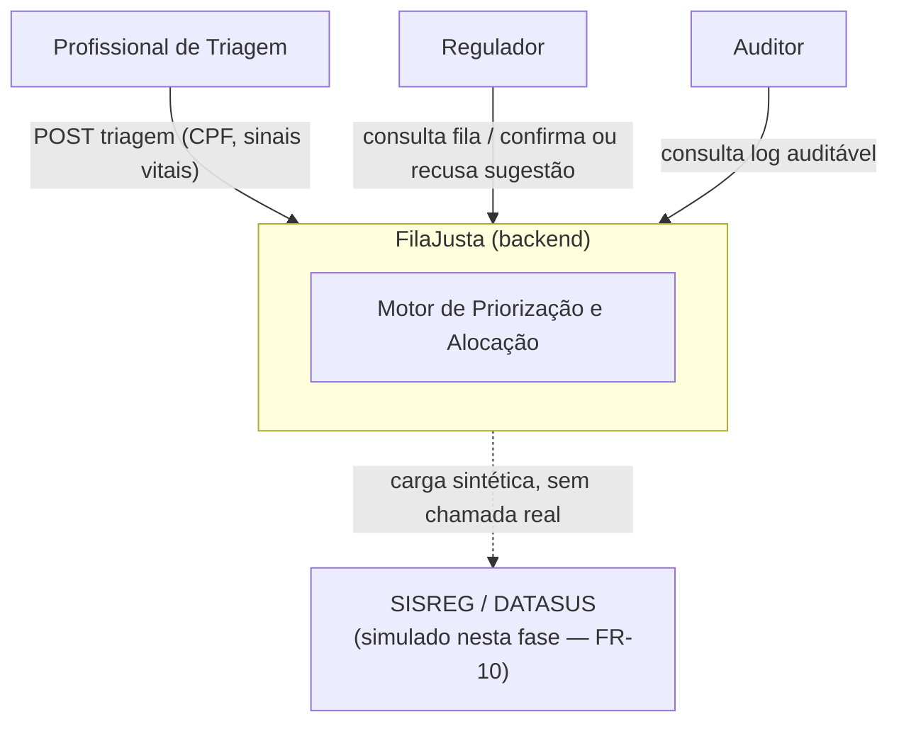
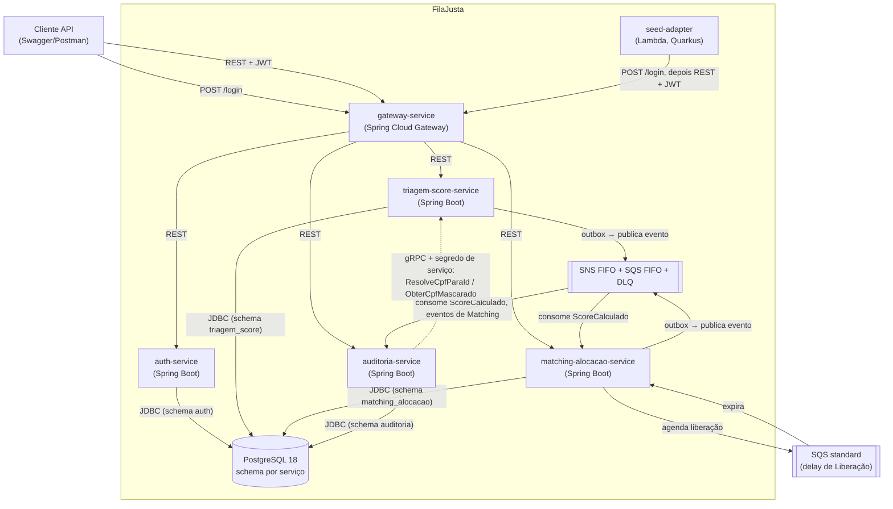
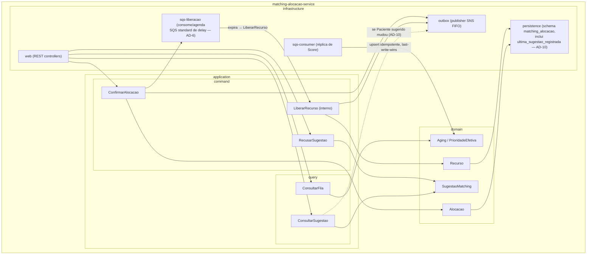
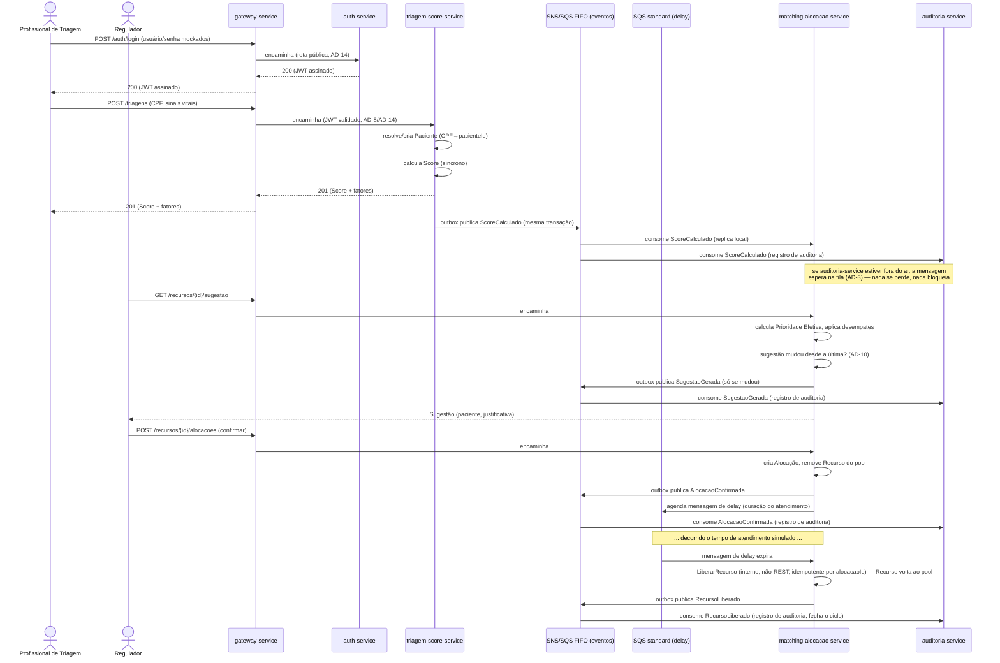

# Solution Design — FilaJusta

> Documento de leitura humana, derivado da spine de arquitetura (`ARCHITECTURE-SPINE.md`, status: final) e do memlog da fase. Enquanto a spine é o contrato terso para quem for construir, este documento existe para explicar o "porquê" a quem for avaliar: a banca do hackathon FIAP Pós-Tech Fase 5.

## 1. Contexto e objetivo

O FilaJusta é o motor de backend que decide, de forma objetiva e auditável, quem deve ser atendido a seguir em uma fila de saúde do SUS — substituindo a ordem de chegada por um Score de prioridade clínica calculado na triagem e emparelhando cada paciente ao recurso disponível mais adequado em tempo real. O diferencial não é o mecanismo de matching em si, mas a combinação de priorização objetiva **com** explicabilidade desde o design: toda decisão de alocação gera um registro que responde "por que fulano foi atendido antes de mim".

A arquitetura adota microsserviços deliberadamente, usando Spring Cloud, CQRS (comandos e consultas separados) e Event Storming (mapeamento de eventos de domínio para descobrir limites de serviço) como o addendum técnico pediu — não porque o volume de dados do MVP (dezenas de pacientes, poucos recursos) exija escala, mas porque é um salto de complexidade arquitetural intencional em relação ao monólito modular da entrega anterior do mesmo aluno (Fase 4). Cada bounded context vira um serviço com fronteira de dados própria, comunicação assíncrona por eventos onde a continuidade importa e uma fronteira de privacidade (CPF) fisicamente isolada — não apenas documentada.

## 2. C4 Nível 1 — Contexto do Sistema

Os três atores diretos (Profissional de Triagem, Regulador, Auditor) acessam o sistema via API — não há frontend nesta fase (PRD §2.2). O Paciente é beneficiário indireto, representado nas respostas do sistema mas sem acesso direto. A integração com SISREG/DATASUS é inteiramente simulada: a fronteira existe na arquitetura (para uma troca futura), mas nenhuma chamada real ocorre.

## 3. C4 Nível 2 — Contêineres

Cinco contêineres de runtime (gateway + `auth-service` + 3 serviços de domínio), um job serverless (`seed-adapter`), um banco compartilhado com isolamento lógico por schema e um backbone de mensageria assíncrona — que na verdade são duas filas com papéis distintos: SNS/SQS **FIFO** para eventos de domínio (ordem importa) e SQS **standard** só para o temporizador de Liberação de Recurso (FIFO não suporta delay por mensagem). Cada seta carrega o protocolo explícito — é uma escolha deliberada: onde a comunicação é síncrona (REST, gRPC), a latência é assumida; onde é assíncrona (SNS/SQS), a indisponibilidade momentânea de um consumidor não derruba o produtor.

## 4. C4 Nível 3 — Componentes (`matching-alocacao-service`)

`matching-alocacao-service` é o contêiner mais interessante para detalhar: concentra a regra de negócio central do produto (a sugestão de matching e seus desempates, AD-5) e os padrões de integração da arquitetura — evento consumido (`sqs-consumer`), comando interno disparado por fila (`LiberarRecurso`) e API pública síncrona via REST (gRPC não é usado neste serviço).

`LiberarRecurso` não tem uma seta partindo de `web/` — é deliberado (AD-6): o único gatilho é a expiração de uma mensagem SQS de delay, nunca um endpoint REST. `sqs-consumer` alimenta apenas a réplica local de Score/Aging (`D4`), nunca o `domain` de Recurso/Alocação — o serviço nunca recalcula ou corrige um Score, só o lê. `ConsultarSugestao` (`Q2`) é, do ponto de vista de quem chama, uma consulta pura — mas internamente compara o resultado com a última sugestão registrada para aquele Recurso e, se mudou, dispara o evento `SugestaoGerada` pelo outbox (AD-10); é a única exceção documentada à regra de que consultas nunca mutam nada (AD-2), porque o dado que ela atualiza não é estado de negócio, é só um controle de deduplicação para a auditoria.

## 5. Decisões arquiteturais principais

### AD-1 — Três serviços, não quatro

O addendum listava quatro bounded contexts prováveis, incluindo "Ingestão/Adaptador". Na prática, esse contexto não tem consultas nem estado próprio de longo prazo — é uma carga única disparada no deploy (FR-10). Transformá-lo num serviço sempre ativo custaria uma task ECS rodando 24/7 sem nunca atender uma requisição de negócio. Virou `seed-adapter`, um job Lambda que se autentica como qualquer outro cliente (login mockado contra `auth-service`, AD-14) e entra pelo mesmo gateway — sem privilégio especial de acesso direto aos outros serviços.

### AD-2 — CQRS lógico, não físico

O addendum pedia para avaliar CQRS por serviço, não aplicá-lo cegamente. Com dezenas de registros no MVP, um read-model separado seria complexidade sem retorno. A decisão documentada é: comandos e consultas em pacotes distintos, mesmo banco — e se o produto crescesse para produção real, `matching-alocacao-service` seria o primeiro candidato a um read-model dedicado, porque a fila é consultada com ordens de magnitude mais frequência do que é escrita.

### AD-3 — Outbox + SNS/SQS FIFO em vez de chamada síncrona

O PRD exige que a resposta da Triagem nunca espere por Matching ou Auditoria e que nenhum evento se perca se um desses serviços cair. Uma chamada gRPC síncrona resolveria a latência, mas não a resiliência: se `auditoria-service` estivesse fora do ar, a chamada falharia. A escolha foi então gravar o evento na mesma transação do comando (outbox) e publicar de forma assíncrona — o consumidor processa quando voltar. FIFO (em vez de standard) foi escolhido para dar ordem determinística por paciente/recurso sem depender de heurísticas de reconciliação — com uma exceção: a fila de delay que dispara a Liberação de Recurso (AD-6, abaixo) é standard, porque FIFO não suporta delay por mensagem. O ponto mais sutil, encontrado só na revisão adversarial da spine: o `eventId` precisa ser gerado no momento em que a linha do outbox é gravada — não quando o relay publica — senão uma nova tentativa após falha de rede geraria um ID novo para o mesmo fato, quebrando a deduplicação de que a Auditoria depende para nunca duplicar um registro.

### AD-4 — Score é dono único, réplicas são somente-leitura

Só `triagem-score-service` calcula e persiste o Score. `matching-alocacao-service` mantém uma réplica local, mas nunca a corrige — ela existe só para que a fila possa ser consultada sem uma chamada síncrona a cada leitura. A Prioridade Efetiva (Score + Aging) é sempre recalculada a partir dessa réplica no momento da consulta, nunca cacheada em memória — isso importa porque o serviço pode rodar em múltiplas instâncias simultâneas (ECS Fargate escalável) e um valor cacheado divergiria entre instâncias. Um caso descoberto na revisão adversarial: se essa réplica nascer vazia (deploy novo, ou recuperação de um incidente), os eventos antigos já saíram da retenção do SQS e nunca mais chegam sozinhos — por isso o serviço faz uma chamada REST de bootstrap a `triagem-score-service` no arranque, só quando a réplica está vazia, para não ficar com a fila errada silenciosamente.

### AD-5 — Especificidade de Recurso e desempates, sempre determinísticos

A regra de negócio central do produto: qual Paciente recebe qual Recurso quando mais de um é elegível. Recursos são ordenados por `especificidadeRank` (leito comum < leito UTI < leito UTI especializado < especialista) — a sugestão sempre prefere o Recurso genérico que resolve o caso, preservando o raro para quem realmente precisa. Pacientes empatados em Prioridade Efetiva são desempatados pela Triagem mais antiga (o mesmo princípio de *price-time priority* de um livro de ofertas de bolsa). O ponto que a revisão adversarial corrigiu: o desempate residual (quando até o timestamp empata, o que acontece de propósito no seed) inicialmente caía num UUID de paciente sem significado nenhum — um auditor não consegue explicar "por que fulano venceu" com "porque o ID dele era menor". A correção usa o número de sequência da Triagem (um inteiro que cresce a cada registro) como critério final, que ao menos é legível como "quem chegou primeiro no sistema". Uma Recusa também é lembrada: o par Recurso/Paciente recusado não volta a ser sugerido para aquele mesmo Recurso, embora o Paciente continue elegível para qualquer outro.

### AD-6 — Liberação de Recurso via mensagem de delay, não scheduler externo

A duração do atendimento simulado (2–5 minutos de relógio real, não horas simuladas aceleradas) é curta o suficiente para caber dentro da gravação da demo em vídeo. O limite físico de 15 minutos do `DelaySeconds` do SQS foi verificado durante a revisão adversarial da spine — os valores escolhidos folgam bastante dessa margem, mas a regra documenta o teto para não ser violada por um tipo de recurso futuro com atendimento mais longo. A mesma revisão encontrou um problema mais sério: filas SQS **FIFO** (as usadas para os eventos de domínio, AD-3) não suportam delay por mensagem — só filas **standard** suportam. A correção separa os dois mecanismos: os eventos de domínio continuam FIFO (ordem importa) e a Liberação usa uma fila SQS standard dedicada só para o temporizador. O processamento da expiração também precisa ser idempotente por `alocacaoId`, porque o SQS pode reentregar a mesma mensagem mais de uma vez.

### AD-7 — CPF nunca sai da fronteira de ingestão

É a decisão mais visivelmente ligada ao diferencial de auditabilidade do produto: se o CPF vazasse para o Log Auditável ou para o Matching, qualquer vazamento de dados nesses serviços exporia identificação direta de paciente. A regra vai além do CPF — nenhum atributo de identificação direta (nome, endereço, contato) pode sair do serviço de ingestão, fechando uma brecha que um desenvolvedor bem-intencionado poderia abrir sem perceber (ex.: adicionar o nome do paciente a um evento "só para a UI mostrar bonito"). A revisão adversarial apontou que o isolamento de rede sozinho não bastava para o dado mais sensível do sistema: os dois endpoints gRPC que tocam CPF agora exigem também um segredo de serviço, não apenas a barreira de security group — assim, nenhum serviço acessa diretamente esse dado só por estar na mesma rede.

### AD-10 — Log Auditável idempotente — e quem decide "mudou"

O diferencial de auditabilidade só é confiável se o log nunca duplicar nem perder um registro sob reentrega — daí cada linha guardar o `eventId` de origem como chave de deduplicação (o mesmo `eventId` do AD-3, nunca reescrito). Mas há um segundo problema, mais sutil: FR-6 recalcula a sugestão a cada consulta, então registrar um evento a cada `GET` inundaria o log sem gerar informação nova. A regra é registrar `SugestaoGerada` só quando o Paciente sugerido para aquele Recurso muda. Isso levanta uma pergunta arquitetural real — quem é o dono desse "mudou ou não mudou"? A resposta documentada: é `matching-alocacao-service`, não `auditoria-service` — a própria consulta que responde a sugestão mantém, como efeito colateral documentado (exceção ao CQRS lógico do AD-2), um registro da última sugestão feita para cada Recurso e só publica o evento quando esse valor muda.

### AD-12 — Isolamento de rede por security group, não por subnet privada

A decisão mais orientada a custo do documento: uma VPC com subnet pública única, sem NAT Gateway (explicitamente vetado como custo recorrente pelo PRD/addendum), usando security groups para impedir que qualquer coisa além do gateway alcance as portas HTTP dos serviços de domínio. É uma troca consciente: perde-se a defesa em profundidade de uma subnet privada verdadeira, mas o custo de NAT — que seria recorrente durante toda a janela do hackathon, não só durante a demo — cai a zero.

### AD-14 — Autenticação via serviço dedicado, não bearer fixo

Esta decisão reabriu uma escolha que já estava `final`: originalmente, `gateway-service` validava um bearer estático mockado, igual para todo cliente, configurado direto no gateway. A reconsideração veio do próprio autor do projeto durante a quebra de epics — não de uma falha técnica encontrada, mas do reconhecimento de que um valor fixo em config demonstra menos arquitetura do que vale a pena para a avaliação de "Inovação"/"Arquitetura" da banca, sem custar tempo real de implementação (o mecanismo de validação no gateway continua igualmente simples). A escolha foi um meio-termo deliberado entre três opções: manter o bearer fixo, construir um `auth-service` com CRUD completo de usuário, ou um `auth-service` enxuto que só faz login contra usuários sintéticos pré-cadastrados. A segunda opção foi descartada por escopo — CRUD de usuário puxaria novos FRs e Non-Goals que o PRD não cobre e que um hackathon solo não tem tempo de sustentar com qualidade. A terceira venceu: `auth-service` tem uma tabela de usuários fixos, carregada por migration na subida do serviço (não pelo `seed-adapter`, que continua isolado ao domínio de unidades/leitos/especialistas), expõe só `POST /v1/auth/login` e emite um JWT assinado com um segredo compartilhado com o gateway — o mesmo padrão de segredo de serviço já usado no AD-7 para os endpoints de CPF, reaproveitado aqui em vez de inventar um mecanismo novo. `gateway-service` continua sendo o único ponto que valida token (AD-8) — só que agora verifica uma assinatura JWT em vez de comparar uma string fixa, sem criar um segundo lugar de enforcement. O claim de papel (`role`) viaja no token só para dar rastreabilidade e abrir caminho para um RBAC futuro; nenhum serviço o interpreta como controle de acesso hoje, preservando o Non-Goal do PRD.

## 6. Fluxo ponta a ponta

O ciclo Triagem → Score → Sugestão → Confirmação → Alocação → uso → Liberação → Log Auditável nunca depende de uma chamada síncrona entre `triagem-score-service` e `matching-alocacao-service`, nem de um passo manual para liberar um recurso — os pontos que a arquitetura mais protege contra divergência (AD-3 para a propagação de eventos, AD-6 para o ciclo de vida do Recurso, AD-10 para o que efetivamente vira registro de auditoria).

## 7. Rastreabilidade de requisitos

| Requisito | Contêiner / Componente | Decisões que governam |
| --- | --- | --- |
| FR-1 Registro de Triagem | `triagem-score-service` → `infrastructure/web` | AD-1, AD-2, AD-11 |
| FR-2 Identificação mínima do Paciente | `triagem-score-service` → `domain` (Paciente) | AD-1, AD-7 |
| FR-3 Cálculo do Score | `triagem-score-service` → `application/command` | AD-3, AD-4 |
| FR-4 Determinismo do Score | `triagem-score-service` → `domain` (Score) | AD-4 |
| FR-5 Sugestão de Matching | `matching-alocacao-service` → `application/query` | AD-4, AD-5 |
| FR-6 Consulta da fila e sugestões | `matching-alocacao-service` → `application/query` | AD-2, AD-10 |
| FR-7 Aging da Prioridade Efetiva | `matching-alocacao-service` → `domain` (Aging) | AD-4 |
| FR-8 Registro de decisão | `auditoria-service` → `application/command` (consumida via `sqs-consumer`) | AD-3, AD-10 |
| FR-9 Consulta de auditoria | `auditoria-service` → `infrastructure/grpc-client` | AD-7, AD-10 |
| FR-10 Carga de dados sintéticos | `seed-adapter` (job Lambda) | AD-1, AD-8 |
| FR-11 Autenticação por token mockado | `auth-service` (emissão) + `gateway-service` (validação) | AD-8, AD-12, AD-14 |
| FR-12 Confirmação/recusa da sugestão | `matching-alocacao-service` → `application/command` | AD-1, AD-6 |
| FR-13 Liberação de Recurso | `matching-alocacao-service` → `application/command` (`LiberarRecurso`, interno) | AD-6 |

Isolamento por schema (AD-9) e topologia de rede (AD-12) são invariantes transversais — aplicam-se a todas as linhas acima, mesmo onde não citados explicitamente.
