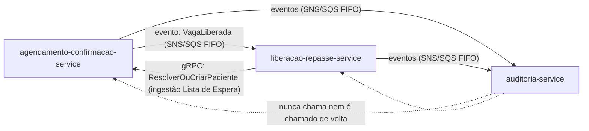
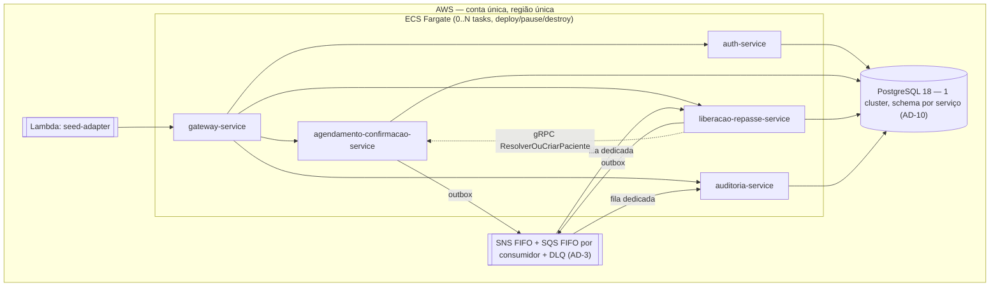
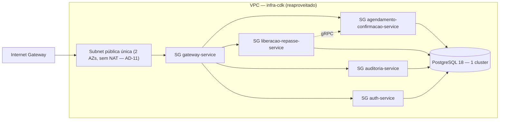
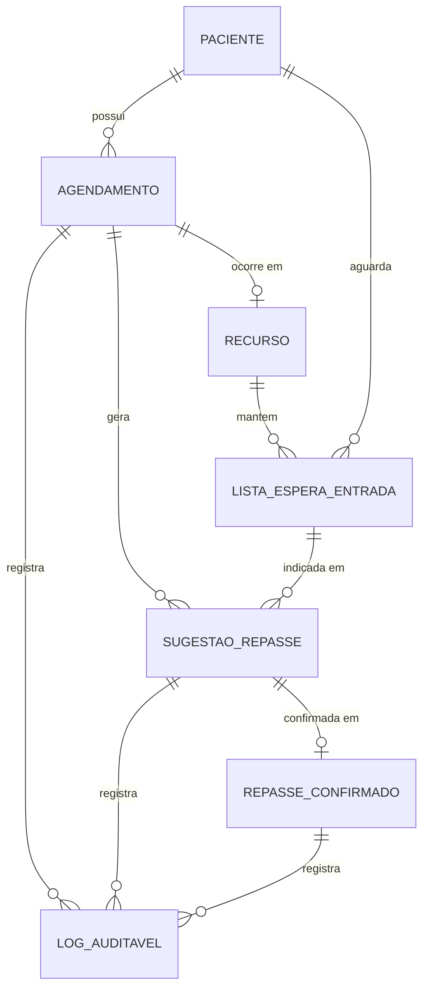

# Architecture Spine — ConfirmaSUS

## Design Paradigm

Microsserviços, um por bounded context, herdado silenciosamente da fase anterior do mesmo projeto (memlog, PRD §8) — o mesmo modelo, não uma reavaliação. Dos serviços de runtime existentes, dois são **renomeados e podados** em vez de reescritos (decisão do memlog): `triagem-score-service` → `agendamento-confirmacao-service`, `matching-alocacao-service` → `liberacao-repasse-service`. Um terceiro é novo: `auditoria-service` (desenho já existente no spine antigo como AD-10, nunca implementado — retomado agora). `auth-service`, `gateway-service` e `infra-cdk` são reaproveitados sem alteração. `seed-adapter` continua um job Lambda (Quarkus), não um serviço de runtime — carga única no deploy, sem ciclo de vida próprio que justifique um serviço sempre no ar.

Dentro de cada serviço de runtime, **Clean Architecture** — `domain/` (sem dependência de framework) → `application/` (casos de uso) → `infrastructure/` (web, gRPC, persistência, mensageria, scheduler). **CQRS lógico** por serviço: `application/command/*` muta e emite evento, `application/query/*` só lê (AD-2). Mesmo banco, sem store de leitura separado — o volume do MVP não justifica CQRS físico.

A topologia completa de contêineres e a rede que os conecta está em Structural Seed — não repetida aqui.

## Invariants & Rules

### AD-1 — Bounded contexts, nomes concretos e propriedade de dados

- **Binds:** all
- **Prevents:** dois serviços possuindo/mutando a mesma entidade; um serviço lendo/escrevendo direto na base de outro; um cliente contornando o gateway; CPF persistido fora do serviço de ingestão de identidade.
- **Rule:** `[ADOPTED — topologia, memlog]` três serviços de runtime de domínio:
  - **`agendamento-confirmacao-service`** (renomeado de `triagem-score-service`) — dono de `Paciente`, `Agendamento`, `Janela de Confirmação`, `Confirmação`, `Recusa`, `Não Confirmado`, `Vaga Liberada`. Mantém `Paciente`/`Cpf`/`ResolverOuCriarPaciente` do serviço antigo; descarta `Triagem`/`Score`/`GravidadePercebida`/`SinaisVitais`/`CalculadorDeScore` por completo (sem migração de dado, sem endpoint remanescente).
  - **`liberacao-repasse-service`** (renomeado de `matching-alocacao-service`) — dono de `Recurso` (catálogo, sem `especificidadeRank`/tiers), `Lista de Espera`, `Sugestão de Repasse`, `Repasse Confirmado`. Reaproveita `Alocacao`/`ConfirmarAlocacao`/`RecusarSugestao` como molde estrutural, **renomeados** para o domínio de Repasse: entidade `Alocacao` → `RepasseConfirmado`, comando `ConfirmarAlocacao` → `ConfirmarRepasse`, comando `RecusarSugestao` → `RecusarSugestaoRepasse`, registro de recusa `SugestaoRecusada` → `SugestaoRepasseRecusada` (escolha desta distilação: nome de domínio, não nome técnico legado — um auditor lendo o código não deveria precisar traduzir "Alocacao" mentalmente para "Repasse"). Descarta `Sugestão de Matching`/`Prioridade Efetiva`/tiers de especificidade — a Lista de Espera é ordenada exclusivamente por timestamp de entrada (FR-8, guardrail SM-C1). **Descarta também** toda a infraestrutura de réplica de Score herdada do domínio antigo — `ScoreReplica`, `ScoreBootstrapService`, `TriagemScoreClient`, `ScoreCalculadoConsumerJob` — e o mecanismo antigo de delay de liberação — `LiberacaoAgendadaRelayJob`/fila SQS standard de delay — já superado pelo poller do AD-5; nenhum desses sobrevive à renomeação, mesmo sem migração de dado que os force a desaparecer.
  - **`auditoria-service`** (novo, desenho reaproveitado do AD-10 do spine antigo) — só leitura + consumidor de eventos via SNS/SQS FIFO das filas dedicadas dos dois serviços de domínio acima. Nunca é chamado de forma síncrona pelo fluxo principal (ver AD-7).
  - `auth-service`, `gateway-service`, `infra-cdk` — sem alteração de nome nem de comportamento **de aplicação**; os *construtos* CDK concretos (`FargateService`/`SecurityGroup` por serviço, rotas do gateway) para `agendamento-confirmacao-service`/`liberacao-repasse-service`/`auditoria-service` são trabalho novo de `bmad-build` — só o padrão de `infra-cdk` é herdado, não a topologia já implantada (ver Deferred).
  - `seed-adapter` (job Lambda, Quarkus) — entra pelo gateway como qualquer cliente (nunca chama serviço de domínio diretamente), autentica-se com usuário técnico pré-cadastrado (AD-13), e faz *upsert* idempotente de três coisas, nesta ordem de dependência: catálogo de `Recurso` por `codigoRecurso` (em `liberacao-repasse-service`, mesmo padrão do `seed-adapter` antigo), Agendamentos (em `agendamento-confirmacao-service`), e entradas de Lista de Espera (em `liberacao-repasse-service`, via `ResolverOuCriarPaciente`). A ingestão de Lista de Espera **só acontece por este caminho de seed** — não existe endpoint runtime-facing para um Paciente "entrar" na Lista de Espera (PRD não define um; FR-9 menciona repescagem como cenário não-automático, não como API a construir).
  - **Propriedade do catálogo de Recurso:** `liberacao-repasse-service` é o dono canônico de `Recurso` (herdeiro direto do `Recurso` antigo). `agendamento-confirmacao-service` guarda apenas `recursoId` + rótulo denormalizado no `Agendamento` — populado uma vez pelo `seed-adapter`, sem sincronização em runtime entre os dois serviços (catálogo estático no MVP). Qualquer dado de outro contexto só é obtido via API pública (pelo gateway), evento de domínio (AD-3) ou gRPC interno (AD-8) — nunca acesso direto a schema alheio (AD-9).
  - Direção de dependência entre os três serviços de domínio:



  Nenhum serviço de domínio chama `auditoria-service` de volta; `auditoria-service` nunca inicia uma chamada síncrona a outro serviço.

### AD-2 — CQRS lógico e Clean Architecture por serviço

- **Binds:** all
- **Prevents:** lógica de domínio acoplada a Spring/JPA/gRPC; comandos e consultas emaranhados de forma que não fique óbvio onde adicionar um novo caso de uso.
- **Rule:** `[ADOPTED — herdado sem alteração]` `domain/` nunca importa framework. `application/command/*` muta estado e emite evento (outbox, AD-3); `application/query/*` só lê. Mesmo banco, sem store de leitura separado — decisão avaliada por serviço, não aplicada às cegas; o volume do MVP não justifica um read-model dedicado em nenhum dos três serviços de domínio.

### AD-3 — Propagação assíncrona de eventos de domínio (Outbox + SNS/SQS FIFO)

- **Binds:** FR-3, FR-6, FR-7, FR-9, FR-10, FR-11, NFR Continuidade sob falha parcial
- **Prevents:** o fluxo de Confirmação/Recusa bloqueando por indisponibilidade de `liberacao-repasse-service` ou `auditoria-service`; perda de evento se um consumidor estiver fora do ar; reentrega criando um `eventId` novo para o mesmo fato de negócio.
- **Rule:** `[ADOPTED — herdado, adaptado]` todo produtor (`agendamento-confirmacao-service`, `liberacao-repasse-service`) grava o evento numa tabela outbox na mesma transação local do comando; `eventId` gerado na application layer (UUID v4), nunca regenerado pelo relay numa nova tentativa. O relay é um poller periódico que só marca a linha publicada após confirmação do broker. Publica num tópico SNS FIFO; cada serviço consumidor tem sua própria fila SQS FIFO assinada (fan-out): `liberacao-repasse-service` assina o evento `VagaLiberada` de `agendamento-confirmacao-service`; `auditoria-service` assina os eventos de ambos os serviços de domínio. `MessageGroupId = agendamentoId` (eventos de Confirmação/Recusa/Não Confirmado/Vaga Liberada) ou `recursoId` (eventos de Sugestão de Repasse/Repasse Confirmado/Recusado) para garantir ordem por agregado; `MessageDeduplicationId = eventId`. Cada fila tem DLQ associada (`maxReceiveCount = 5`), investigada manualmente. Este é o único mecanismo de propagação assíncrona do sistema — a fila SQS standard de delay do spine antigo (AD-6 lá) **não existe mais**: o mecanismo de expiração da Janela de Confirmação é o poller do AD-5 abaixo, não uma mensagem atrasada.
- Eventos de domínio publicados: `ConfirmacaoRegistrada`, `RecusaRegistrada`, `AgendamentoNaoConfirmado`, `VagaLiberada` (produzidos por `agendamento-confirmacao-service`); `SugestaoRepasseGerada`, `RepasseConfirmado`, `RepasseRecusado` (produzidos por `liberacao-repasse-service`).

### AD-4 — Máquina de estados do Agendamento e propriedade da Vaga Liberada

- **Binds:** FR-3, FR-4, FR-5, FR-6, FR-7
- **Prevents:** dois caminhos concorrentes (Confirmação vs. expiração) decidindo o destino do mesmo Agendamento; um estado de Agendamento sem transição definida; ambiguidade sobre se "Vaga Liberada" é um estado do Agendamento ou uma entidade separada.
- **Rule:** `Agendamento` (em `agendamento-confirmacao-service`) tem estado único: `AGUARDANDO_JANELA` → `AGUARDANDO_CONFIRMACAO` (ver AD-5 para o gatilho de abertura) → `CONFIRMADO` (terminal, via FR-4) **ou** `LIBERADO` (terminal, via Recusa FR-5 ou expiração FR-6), com um campo `motivoLiberacao ∈ {RECUSA, NAO_CONFIRMADO}` para a causa distinta exigida pelo Log Auditável (FR-6, FR-12). "Vaga Liberada" não é uma entidade separada — é o estado `LIBERADO` do próprio Agendamento; a transição para `LIBERADO` é o evento que dispara `VagaLiberada` (AD-3), consumido por `liberacao-repasse-service` para gerar a Sugestão de Repasse (AD-6). Toda transição de estado é uma escrita condicional (`UPDATE ... WHERE status = <estado_esperado>`) — nunca uma leitura-depois-escrita sem guarda — para que Confirmação (FR-4), Recusa (FR-5) e a expiração do poller (AD-5) concorrentes no mesmo Agendamento produzam no máximo uma transição vencedora. A perdedora **não é tratada uniformemente como erro**: antes de reportar conflito, o comando relê o estado atual — se já é `CONFIRMADO` pela mesma confirmação (mesmo `agendamentoId`, `FR-4` idempotente por natureza, sem novo registro), retorna sucesso silencioso; qualquer outro estado perdedor (`LIBERADO`, ou `AGUARDANDO_JANELA` ainda não aberta) retorna o erro de janela fechada/ainda não aberta exigido por FR-4. Só existe conflito de verdade quando o estado final diverge do que o chamador pediu — confirmação duplicada nunca é esse caso.

### AD-5 — Abertura e expiração da Janela de Confirmação via poller `@Scheduled`

- **Binds:** FR-3, FR-6, NFR Continuidade sob falha parcial
- **Prevents:** duplicação de `NotificacaoConfirmacaoPublicada` ou `AgendamentoNaoConfirmado` sob múltiplas instâncias do serviço rodando o mesmo poller; dependência de um mecanismo de delay de mensageria incompatível com uma janela de 48h; FR-3 sem mecanismo simétrico ao de expiração.
- **Rule:** `[ADOPTED — memlog, expiração; abertura é extensão simétrica desta distilação]` `agendamento-confirmacao-service` roda **dois pollers `@Scheduled`** sobre o mesmo `Agendamento`, ambos com a mesma disciplina de escrita condicional:
  - **Abertura** (FR-3): seleciona Agendamentos com `status = AGUARDANDO_JANELA` e `janelaAbreEm <= now()` (`janelaAbreEm = dataHoraAgendamento - duração da Janela`), aplica `UPDATE ... WHERE status = 'AGUARDANDO_JANELA'` para transicionar a `AGUARDANDO_CONFIRMACAO`, publicando `NotificacaoConfirmacaoPublicada` via outbox (AD-3) na mesma transação — a escrita condicional garante que a notificação seja publicada exatamente uma vez por Agendamento mesmo sob reprocessamento do poller (idempotência exigida por FR-3).
  - **Expiração** (FR-6): seleciona Agendamentos com `status = AGUARDANDO_CONFIRMACAO` e `janelaExpiraEm <= now()`, aplica `UPDATE ... WHERE status = 'AGUARDANDO_CONFIRMACAO'` para transicionar a `LIBERADO`/`motivoLiberacao = NAO_CONFIRMADO`, publicando `AgendamentoNaoConfirmado` + `VagaLiberada` via outbox (AD-3) na mesma transação.

  A escrita condicional garante idempotência mesmo com múltiplas tasks ECS rodando o mesmo poller concorrentemente: cada linha só é processada por uma delas, sem lock distribuído explícito. Cadência exata de ambos os pollers — `[Deferred]`.

### AD-6 — Lista de Espera FIFO pura e geração de Sugestão de Repasse

- **Binds:** FR-7, FR-8, FR-9, FR-10, FR-11
- **Prevents:** qualquer critério de ordenação da Lista de Espera além de timestamp de chegada (guardrail legal permanente, SM-C1); um Repasse Confirmado sem confirmação humana explícita; um Paciente recusado sendo re-sugerido para a mesma Vaga.
- **Rule:** `liberacao-repasse-service`, ao consumir `VagaLiberada` (AD-3), primeiro verifica idempotência por `agendamentoId` (constraint única em `SugestaoRepasse.agendamentoId` — mesmo padrão de dedup do AD-7, necessário porque a janela de deduplicação nativa do SQS FIFO expira em 5min e este evento pode ser reentregue/redrive de DLQ muito depois): se já existe `SugestaoRepasse` para aquele `agendamentoId`, a mensagem é descartada sem efeito. Caso contrário, consulta sua própria Lista de Espera ordenada exclusivamente por `criadoEm` (timestamp de entrada na fila daquele `recursoId`) e gera uma `SugestaoRepasse` apontando o primeiro candidato elegível, publicando `SugestaoRepasseGerada` (que também serve como notificação mockada ao Gestor de Agenda, FR-9). Se a Lista de Espera estiver vazia, a Vaga permanece marcada como liberada (estado já vive em `agendamento-confirmacao-service`, AD-4) sem sugestão pendente — sem repescagem automática retroativa (Non-Goal do PRD). `SugestaoRepasse` tem a mesma disciplina de escrita condicional do AD-4: `ConfirmarRepasse` e `RecusarSugestaoRepasse` fazem `UPDATE ... WHERE status = 'PENDENTE'`; a perdedora de uma corrida (dois Gestores, duplo clique) recebe `0` linhas afetadas e `409` — nunca as duas committam. `ConfirmarRepasse` (Gestor) cria `RepasseConfirmado`, definitivo. `RecusarSugestaoRepasse` grava `SugestaoRepasseRecusada` (par `recursoId`+`pacienteId`, exclui de futuras sugestões para aquela Vaga) e gera a próxima `SugestaoRepasse` para o próximo candidato da Lista, pulando os recusados; sem mais candidatos, a Vaga permanece liberada sem sugestão pendente. Toda decisão de repasse é humana (FR-10/FR-11) — não existe caminho de código que confirme um Repasse automaticamente.

### AD-7 — Log Auditável: consumidor assíncrono dedicado, nunca chamada síncrona bloqueante

- **Binds:** FR-12, FR-13, NFR Continuidade sob falha parcial
- **Prevents:** o fluxo de Confirmação/Recusa (ou de Repasse) falhando ou bloqueando porque `auditoria-service` está fora do ar; registros de auditoria duplicados ou perdidos sob reentrega.
- **Rule:** `[ADOPTED — memlog, retoma desenho do AD-10 do spine antigo, nunca implementado]` `auditoria-service` é append-only, só leitura + `application/command` interno que grava cada decisão consumida via SQS FIFO (AD-3) — nunca via chamada síncrona a partir de `agendamento-confirmacao-service` ou `liberacao-repasse-service`. Cada registro guarda o `eventId` de origem como chave de deduplicação (mesmo usado como `MessageDeduplicationId`, AD-3); reentregas nunca duplicam uma decisão já registrada. Nenhuma das decisões listadas em FR-12 (notificação, Confirmação, Recusa, Não Confirmado, Liberação, Sugestão de Repasse, confirmação/recusa de repasse) ocorre sem gerar o evento correspondente — ausência de evento é, por definição, um bug em AD-3/AD-4/AD-6, não em `auditoria-service`. Isso é o que garante a NFR de continuidade sob falha parcial: a escrita de domínio (Confirmação/Recusa/Repasse) commita e publica no outbox independentemente de `auditoria-service` estar respondendo.
- **Vocabulário compartilhado do campo `motivo`** (mesmo schema de evento, AD-3, nunca inventado independentemente por cada produtor): `ConfirmacaoRegistrada`→`motivo: null` (ação positiva, sem causa a explicar); `RecusaRegistrada`→`"RECUSA_PACIENTE"`; `AgendamentoNaoConfirmado`→`"EXPIRACAO_JANELA"`; `VagaLiberada`→herda o `motivoLiberacao` do Agendamento (AD-4: `"RECUSA"` ou `"NAO_CONFIRMADO"`); `SugestaoRepasseGerada`→`motivo: null`; `RepasseConfirmado`→`"CONFIRMACAO_GESTOR"`; `RepasseRecusado`→`"RECUSA_GESTOR"`. `auditoria-service` persiste `motivo` como coluna nullable — sua ausência é esperada para os dois eventos sem causa a registrar, não um dado faltando.

### AD-8 — Fronteira do CPF e minimização de dados

- **Binds:** FR-1, FR-2, §8 Constraints do PRD
- **Prevents:** CPF persistido ou trafegando fora de `agendamento-confirmacao-service`; CPF em evento de domínio, log ou schema de `liberacao-repasse-service`/`auditoria-service`; uma chamada síncrona travada indefinidamente se `agendamento-confirmacao-service` estiver fora do ar durante o seed.
- **Rule:** `[ADOPTED — princípio herdado do AD-9 do spine antigo, adaptado: sem distinção "dado clínico" vs. administrativo]` validação de formato/checksum do CPF (FR-2) ocorre em `agendamento-confirmacao-service` antes de qualquer resolução de ID; a rejeição do registro de seed correspondente (FR-1) é a consequência observável dessa validação. CPF em texto claro só existe nesse serviço (agregado `Paciente`). O único meio de outro componente obter um `pacienteId` a partir de um CPF é o endpoint gRPC interno `ResolverOuCriarPaciente(cpf) -> pacienteId`, exclusivo para `liberacao-repasse-service` ao ingerir Lista de Espera sintética — chamado **apenas pelo `seed-adapter` em tempo de deploy** (AD-1), nunca por um endpoint REST runtime-facing (não existe no PRD). Sendo uma chamada só de deploy/seed, é síncrona com timeout curto (`[ASSUMPTION]` 5s) e sem retry — falha rápido; se `agendamento-confirmacao-service` estiver fora do ar, o `seed-adapter` falha aquele registro de Lista de Espera e pode ser reexecutado (idempotente, AD-1), sem exigir circuit-breaker para um caminho que não é de runtime. O CPF nunca é persistido em `liberacao-repasse-service` — só o `pacienteId` retornado pelo gRPC. Isolamento de rede (AD-11) mais um segredo compartilhado em metadata gRPC protegem esse endpoint. Nenhum evento de domínio (AD-3), Log Auditável (FR-12) ou schema fora de `agendamento-confirmacao-service` carrega CPF — apenas `pacienteId`.

### AD-9 — Autenticação no Gateway

- **Binds:** FR-14
- **Prevents:** cada serviço reimplementando checagem de token de forma divergente; um cliente externo acessando um serviço de domínio pulando o gateway.
- **Rule:** `[ADOPTED — herdado sem alteração]` `gateway-service` (Spring Cloud Gateway) é o único ponto que valida o JWT emitido por `auth-service` (AD-13) para qualquer cliente, incluindo `seed-adapter`; health-check e `POST /v1/auth/login` são públicos via exceção estreita e nomeada de security group (AD-11). Chamadas internas (gRPC, consumo de fila) não passam pelo gateway. Sem RBAC aplicado (Non-Goal do PRD, FR-14) — mesma postura consciente herdada.

### AD-10 — Isolamento por schema num único cluster Postgres

- **Binds:** all (persistência)
- **Prevents:** acoplamento de banco entre serviços que a separação em microsserviços deveria eliminar; um desenvolvedor violando o isolamento "sem querer".
- **Rule:** `[ADOPTED — herdado sem alteração]` um único cluster PostgreSQL 18; cada serviço tem schema e usuário próprios (`agendamento_confirmacao`, `liberacao_repasse`, `auditoria`, `auth`), com `REVOKE` explícito de grant cross-schema. Migrations versionadas por serviço; enforcement mecânico via regra ArchUnit por módulo de serviço, como check obrigatório de CI. Backup: snapshot automático diário (retenção mínima 1–3 dias).

### AD-11 — Topologia de rede e isolamento

- **Binds:** all (envelope operacional)
- **Prevents:** um cliente externo ou serviço não autorizado acessando um serviço de domínio diretamente, contornando o gateway; custo de NAT Gateway 24/7.
- **Rule:** `[ADOPTED — herdado sem alteração]` VPC com subnet pública única (2 AZs, sem NAT Gateway — custo). Tasks ECS Fargate com `assignPublicIp=ENABLED`, alcançando SNS/SQS/ECR pela Internet Gateway. Isolamento entre serviços por security group: apenas o SG do `gateway-service` alcança as portas HTTP de aplicação dos demais; SG de health-check do load balancer/ECS alcança só a porta de health-check de cada serviço. gRPC entre `liberacao-repasse-service` e `agendamento-confirmacao-service` (AD-8) é liberado explicitamente entre seus dois security groups; nenhum outro tráfego lateral é permitido.

### AD-12 — Runtime por componente (Spring Boot vs. Quarkus)

- **Binds:** all (build/runtime)
- **Prevents:** um desenvolvedor introduzindo Quarkus num serviço de domínio "porque já tem no projeto".
- **Rule:** `[ADOPTED — herdado sem alteração]` `gateway-service`, `agendamento-confirmacao-service`, `liberacao-repasse-service`, `auditoria-service` e `auth-service` usam Spring Boot/Spring Cloud. `seed-adapter`, função Lambda one-shot, usa Quarkus (cold-start otimizado) — a única mistura de runtime do projeto, deliberada.

### AD-13 — Emissão de token de autenticação via `auth-service` dedicado

- **Binds:** FR-14
- **Prevents:** um bearer estático fixo como única credencial do sistema; um serviço de domínio reimplementando validação de token; `seed-adapter` sem meio de se autenticar.
- **Rule:** `[ADOPTED — herdado sem alteração]` `auth-service` (Spring Boot) tem schema próprio (`auth`, AD-10) com tabela de usuários sintéticos pré-cadastrados por migration (Flyway). Expõe `POST /v1/auth/login`, retorna JWT assinado (HS256, segredo compartilhado com `gateway-service`) com claim `role` puramente informativo — nenhum serviço aplica RBAC a partir dele. `gateway-service` (AD-9) valida assinatura e expiração; `auth-service` só emite. `seed-adapter` usa um usuário técnico pré-cadastrado na mesma tabela.

## Consistency Conventions

| Concern | Convention |
| --- | --- |
| Naming (entidades, eventos, interfaces) | Eventos de domínio em PascalCase no passado (`ConfirmacaoRegistrada`, `RecusaRegistrada`, `AgendamentoNaoConfirmado`, `VagaLiberada`, `SugestaoRepasseGerada`, `RepasseConfirmado`, `RepasseRecusado`); IDs internos = UUID v4 (`pacienteId`, `agendamentoId`, `recursoId`, `sugestaoRepasseId`); CPF nunca é chave fora de `agendamento-confirmacao-service` (AD-8). |
| Data & formats (ids, datas, erros, envelope) | Datas em ISO-8601 UTC; envelope de evento = `{eventId, eventType, occurredAt, version, correlationId, payload}`; cada `eventType` tem schema companion (JSON Schema) versionado junto ao produtor; mudanças de schema são aditivas dentro de uma major version, consumidor ignora campos desconhecidos, `version` incompatível vai para a DLQ (AD-3); erros de API REST seguem RFC 7807 Problem Details; a chamada gRPC (AD-8) usa status codes gRPC padrão (`NOT_FOUND`, `UNAVAILABLE`, `DEADLINE_EXCEEDED`) com detalhes estruturados; contratos REST/proto/evento versionados (`/v1/`, pacote proto `vN`). |
| State & cross-cutting (mutação, log, config, auth) | Mutação só via comando do serviço dono, sempre outbox na mesma transação (AD-3); transição de estado sempre por escrita condicional (AD-4/AD-5); logging estruturado em JSON; segredos via variável de ambiente/AWS Secrets Manager, nunca no repositório; config não-sensível centralizada via Spring Cloud Config; emissão de token via `auth-service` (AD-13), validação só no gateway (AD-9), isolamento de rede via security group (AD-11). |
| Observabilidade | Cada serviço expõe health-check público (`/actuator/health`, AD-9/AD-11), fora da autenticação do gateway; `gateway-service` gera um `correlationId` (UUID) por requisição, propagado em header HTTP, em metadata gRPC (AD-8) e no envelope de evento, permitindo rastrear uma decisão ponta a ponta nos logs estruturados sem tracing distribuído completo. |
| Reprodutibilidade (NFR §7 do PRD) | `[ADOPTED — herdado, infra-cdk]` todo o sistema (5 serviços + `seed-adapter` + banco + mensageria) sobe com um único comando (`cdk deploy`, padrão `deploy/pause/destroy` já validado na fase anterior) — nenhuma migration, seed ou configuração manual fora desse comando. |
| Testes de integração entre contratos (NFR §7 do PRD) | `[ADOPTED — herdado]` Testcontainers (PostgreSQL) para os testes de integração de cada serviço contra seu próprio schema; contrato entre serviços (evento/gRPC) coberto por teste de integração no consumidor contra um payload de exemplo versionado junto ao schema JSON do produtor (AD-3) — sem broker real no teste. |

## Stack

`[ASSUMPTION]` Versões reverificadas via web em 2026-09-17 (Reviewer Gate desta sessão) — a linha de release Spring Boot 4.x/Spring Cloud segue rápida, reconfirmar de novo antes do primeiro build se a distância no tempo for grande.

| Name | Version |
| --- | --- |
| Java | 25 (LTS) |
| Spring Boot | 4.1.1 — `gateway-service`, `auth-service`, `agendamento-confirmacao-service`, `liberacao-repasse-service`, `auditoria-service` |
| Spring Cloud | 2025.1.3 ("Oakwood", compatível com Spring Boot 4.1.x) — Gateway, Config, Netflix Eureka (discovery) |
| Spring gRPC | 1.1.1 — suporte gRPC nativo integrado ao Spring Boot 4.1; a starter standalone `org.springframework.grpc` 1.0.x é só para quem está preso ao Boot 4.0 — não se aplica aqui, sem alternativa real a considerar |
| Quarkus | `seed-adapter` (job Lambda) — AD-12, cold-start otimizado |
| JWT (jjwt ou Spring Security Resource Server) | emissão em `auth-service`, validação em `gateway-service` (AD-13) |
| PostgreSQL | 18, em container Fargate + EFS (não RDS — reaproveitado de `infra-cdk`, ver Structural Seed) |
| AWS SNS + SQS FIFO | mensageria assíncrona de eventos de domínio (Outbox/fan-out, AD-3) |
| AWS ECS Fargate | hospedagem dos serviços, escalável a 0, `assignPublicIp=ENABLED` (AD-11) |
| AWS Lambda | `seed-adapter` |
| Cucumber-JVM | aceitação BDD ponta a ponta (PRD §7) |
| Testcontainers (PostgreSQL) | testes de integração por serviço contra schema real (Consistency Conventions) |
| JaCoCo | ≥ 0.8.14 — versão mínima com suporte oficial ao bytecode do Java 25; versões anteriores não suportam ou só experimentalmente |
| PIT (pitest-maven) | ≥ 1.30.0 — o fix de mutators BigDecimal/BigInteger para Java 25 já está presente desde 1.25.8, mas 1.30.0 é a última estável hoje |

## Structural Seed







```text
confirma-sus/
  gateway-service/                       # inalterado (AD-9)
  auth-service/                          # inalterado (AD-13)
  agendamento-confirmacao-service/
    domain/                              # Paciente, Agendamento, JanelaConfirmacao — sem dependência de framework
    application/
      command/                           # ResolverOuCriarPaciente, RegistrarAgendamento, ConfirmarPresenca, RecusarPresenca, ExpirarJanela (AD-4, AD-5)
      query/                              # ConsultarAgendamento
    infrastructure/
      web/                                # REST controllers (FR-1..FR-6)
      grpc/                               # ResolverOuCriarPaciente (AD-8, chamado só por liberacao-repasse-service)
      scheduler/                          # poller @Scheduled de expiração (AD-5)
      persistence/                        # schema agendamento_confirmacao
      outbox/                             # publisher SNS FIFO (AD-3): ConfirmacaoRegistrada, RecusaRegistrada, AgendamentoNaoConfirmado, VagaLiberada
  liberacao-repasse-service/
    domain/                              # Recurso, ListaEsperaEntrada, SugestaoRepasse, RepasseConfirmado
    application/
      command/                            # RegistrarRecurso (upsert catálogo, só via seed-adapter), RegistrarEntradaListaEspera, GerarSugestaoRepasse (idempotente por agendamentoId, AD-6), ConfirmarRepasse, RecusarSugestaoRepasse (grava SugestaoRepasseRecusada)
      query/                               # ConsultarListaEspera (FR-8), ConsultarSugestoesPendentes
    infrastructure/
      web/ grpc-client/ persistence/       # schema liberacao_repasse
      sqs-consumer/                       # consome VagaLiberada (AD-3, AD-6)
      outbox/                             # publisher SNS FIFO: SugestaoRepasseGerada, RepasseConfirmado, RepasseRecusado
  auditoria-service/
    domain/                              # LogAuditavel (append-only, campo motivo nullable — vocabulário no AD-7)
    application/
      command/                            # RegistrarDecisaoAuditavel (consumida via sqs-consumer, AD-7)
      query/                               # ConsultarAuditoriaPaciente, ConsultarAuditoriaAgendamento (FR-13)
    infrastructure/
      web/ persistence/ sqs-consumer/      # schema auditoria — sem grpc-client, nunca resolve CPF (AD-8)
  seed-adapter/                            # job Lambda (Quarkus, AD-12) — catálogo de Recurso + Agendamentos + Lista de Espera sintéticos (FR-1), upsert idempotente, nesta ordem (AD-1)
  infra-cdk/                               # inalterado
```

`[ADOPTED — memlog]` Composição do seed de demonstração (FR-1): ~18 Agendamentos em 2–3 tipos de Recurso, cobrindo: aguardando dentro da janela; confirmado; recusado com Lista de Espera não vazia (Sugestão pendente); não confirmado por expiração (causa distinta no Log Auditável); liberado sem Lista de Espera (sem sugestão pendente); repasse já confirmado; sugestão recusada pelo Gestor gerando nova sugestão (FR-11). Lista de Espera com 2–3 Pacientes por Recurso. O conteúdo exato (linhas/CSV/JSON do seed) fica para `bmad-build`.

## Capability → Architecture Map

| Capability / Area | Lives in | Governed by |
| --- | --- | --- |
| FR-1 Carga de Agendamentos Sintéticos | `seed-adapter` | AD-1, AD-8, AD-11 |
| FR-2 Resolução de Paciente por CPF | `agendamento-confirmacao-service` | AD-1, AD-8 |
| FR-3 Notificação de Confirmação | `agendamento-confirmacao-service` | AD-3, AD-4 |
| FR-4 Confirmação de Presença | `agendamento-confirmacao-service` | AD-4 |
| FR-5 Recusa Ativa | `agendamento-confirmacao-service` | AD-4 |
| FR-6 Expiração por Não-Resposta | `agendamento-confirmacao-service` | AD-4, AD-5 |
| FR-7 Liberação da Vaga | `agendamento-confirmacao-service` | AD-3, AD-4 |
| FR-8 Consulta da Lista de Espera | `liberacao-repasse-service` | AD-2, AD-6 |
| FR-9 Sugestão de Repasse | `liberacao-repasse-service` | AD-3, AD-6 |
| FR-10 Confirmação do Repasse | `liberacao-repasse-service` | AD-6 |
| FR-11 Recusa do Repasse | `liberacao-repasse-service` | AD-6 |
| FR-12 Registro em Log Auditável | `auditoria-service` | AD-3, AD-7 |
| FR-13 Consulta de Auditoria | `auditoria-service` | AD-7, AD-8 |
| FR-14 Autenticação via auth-service/gateway-service | `auth-service` (emissão) + `gateway-service` (validação) | AD-9, AD-11, AD-13 |

*Nota: AD-10 (isolamento por schema) e AD-11 (rede) se aplicam a todas as linhas acima e não são repetidos célula a célula.*

## Deferred

- **Nomes exatos de classe além dos já fixados nos ADs** (DTOs, exceptions, nomes de tabela) — refinável em `bmad-build`, desde que preservem os nomes de comando/evento/entidade já decididos acima.
- **Cadência exata do poller `@Scheduled`** (AD-5) — não fechada nem pelo PRD nem pelo memlog; calibração fina fica para `bmad-build`/config (`confirmasus.janela.poller.*`).
- **RBAC por papel** (FR-14) — o JWT já carrega claim `role`, mas nenhum serviço aplica controle de acesso por papel nesta fase; fora de escopo explícito do PRD (§5 Non-Goals).
- **Integração real de canal de notificação** (SMS/WhatsApp/e-mail) — a notificação de FR-3/FR-9 permanece mockada (registrada e logada); fora de escopo explícito do PRD (§5 Non-Goals).
- **Conformidade legal plena com a LGPD** — fora de escopo deste MVP acadêmico (PRD §8); AD-8 cobre só o princípio de minimização/fronteira de propagação do CPF.
- **Schema exato de banco por serviço** (colunas, índices, tipos) — detalhe de implementação de `bmad-build`; AD-10 fixa só o isolamento por schema/usuário, não a forma interna das tabelas.
- **Estratégia de migração de schema** (Flyway vs. Liquibase) — detalhe de implementação, não invariante.
- **"Desfazer" uma Confirmação já registrada** (FR-5) — fora de escopo do MVP, revisitável se a demo precisar do cenário (PRD §11).
- **Repescagem automática retroativa** quando um Paciente entra na Lista de Espera após a Vaga já ter ficado liberada sem sugestão (FR-9) — fora de escopo (PRD §11 Non-Goals).
- **Construtos CDK concretos para os 3 serviços de domínio** (`FargateService`/`SecurityGroup` por serviço, rotas do gateway, filas SQS FIFO dedicadas) — só o *padrão* de `infra-cdk` é herdado (AD-1, AD-11); a topologia declarada precisa ser escrita para `agendamento-confirmacao-service`/`liberacao-repasse-service`/`auditoria-service`, nenhum desses construtos existe hoje (nem para os dois serviços renomeados, que hoje são `triagem-score-service`/`matching-alocacao-service` no CDK) — trabalho real de `bmad-build`, não um "reaproveitamento sem alteração" automático.
- **Alta disponibilidade full-produção** (multi-AZ, failover automático, DR além do snapshot diário do AD-10) — fora de escopo por NFR explícito do PRD.
- **Tracing distribuído completo** (ex.: AWS X-Ray) — o `correlationId` propagado (Consistency Conventions) cobre a necessidade mínima de rastreio do MVP.
- **Destino do código de `triagem-score-service`/`matching-alocacao-service` como diretórios físicos** (renomear in-place via `git mv` vs. criar diretórios novos e arquivar os antigos) — decisão de execução de `bmad-build`, não de arquitetura; esta spine só fixa a topologia lógica resultante (AD-1).
