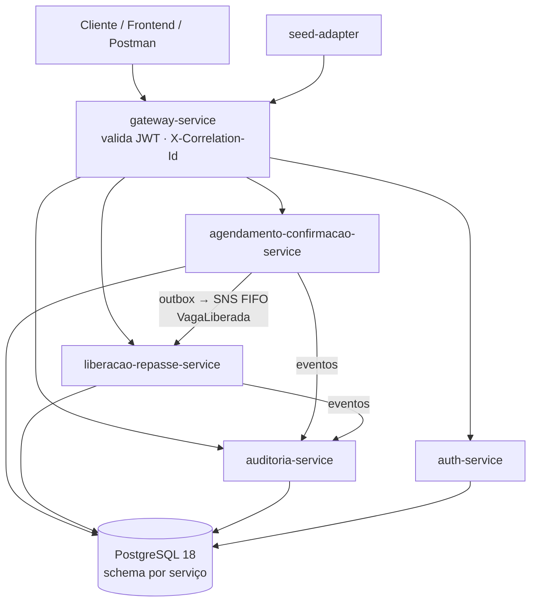

# ConfirmaSUS — Relatório do Projeto

**Hackathon FIAP Pós-Tech — Arquitetura e Desenvolvimento Java (Fase 5)**
**Tema:** Inovação para otimização de atendimento no SUS
**Equipe:** entrega individual — Thiago Henrique Alves Ferreira (RM369442, turma 11ADJT), responsável por produto, arquitetura, desenvolvimento e testes.

---

## 1. Resumo executivo

O **ConfirmaSUS** é um motor de backend que ataca o absenteísmo em consultas e exames do SUS. Ele notifica o paciente sobre um agendamento já existente e exige uma **confirmação ativa** dentro de uma janela de tempo. Se o paciente recusa, ou não responde até o prazo, a vaga é liberada. O sistema então **sugere o próximo paciente da lista de espera, por ordem de chegada**, e um **gestor de agenda humano** confirma ou recusa o repasse. Cada passo fica registrado em um **log auditável**.

- **Objetivo:** transformar vagas ociosas, hoje perdidas em silêncio, em ofertas ativas e rastreáveis para quem está esperando.
- **Impacto esperado:** menos vagas desperdiçadas, filas de espera que andam mais rápido e um histórico que explica a qualquer paciente ou auditor por que a vaga X foi para o paciente Y.
- **Limite legal como princípio de projeto:** nenhuma decisão clínica é automatizada. A lista de espera é ordenada só por ordem de chegada, e todo repasse exige confirmação humana.
- **Estado do MVP:** o ciclo completo funciona ponta a ponta via API (gateway, JWT, eventos assíncronos, auditoria). Há também um frontend React de demonstração, que o edital não exigia.

## 2. Problema identificado

O absenteísmo é um dos desperdícios mais silenciosos do SUS.

| Dado | Fonte |
|---|---|
| Absenteísmo médio de **38,6%** em consultas especializadas e **32,1%** em exames especializados (Região Metropolitana do ES, 2014–2016) | Beltrame et al., 2019/2020 (SciELO) |
| Média mundial de absenteísmo em consultas de **23%**; **27,8%** na América do Sul e **43%** na África | Revisão sistemática citada em Beltrame et al. e em estudos brasileiros |
| **R$ 18,57 milhões** desperdiçados em 3 anos, em 1.002.719 procedimentos não comparecidos, numa única região metropolitana | Beltrame et al. |
| **52,4%** das causas de absenteísmo seriam evitáveis (estudo em atenção especializada na Espanha, citado em literatura brasileira) | Addendum do brief; artigo SciELO acima |

- **Causas mais citadas:** esquecimento, falha de comunicação entre serviço e paciente, melhora do sintoma, conflito de horário ou transporte. Todas são banais e evitáveis.
- **Quem sofre com isso:**
  - o paciente que perde a vaga sem aviso;
  - o paciente da lista de espera que continua esperando enquanto vagas ficam ociosas;
  - o gestor de agenda, que só descobre a ausência tarde demais;
  - o sistema, que paga por profissional, sala e equipamento sem uso.
- **O que já existe:** lembretes por SMS e WhatsApp funcionam. A rede da Sesa-CE registrou queda relativa de 18,75% no absenteísmo em consultas e exames laboratoriais (ago–nov de 2025 contra o mesmo período de 2024) após implantar mensagens de WhatsApp (Governo do Ceará, dez/2025). A revisão Cochrane sobre lembretes por mensagem de celular (Gurol-Urganci et al., 2013) mostra comparecimento de 67,8% sem lembrete contra 78,6% com mensagem.
- **A lacuna:** o lembrete sozinho não fecha o ciclo. Quando o paciente não vem, ou avisa que não virá, ninguém é chamado a tempo de ocupar o lugar, e a decisão de repasse não deixa rastro auditável.

*Verificação: os números acima foram conferidos nas fontes primárias em 29/09/2026 (artigo SciELO/Saúde em Debate, revisão Cochrane CD007458 e nota da Sesa-CE). O Espírito Santo é uma estimativa regional, não nacional. Fontes completas em `_bmad-output/planning-artifacts/briefs/brief-Fase5-2026-09-16/addendum.md`.*

## 3. Descrição da solução

### O ciclo

```
Agendamento (seed) → Janela de Confirmação abre → Notificação (mock)
        │
        ├─ Paciente CONFIRMA ───────────────────────────► CONFIRMADO (fim)
        └─ Paciente RECUSA  ─┐
           ou janela EXPIRA ─┴─► Vaga LIBERADA ──► Sugestão de Repasse (1º da Lista de Espera, por ordem de chegada)
                                                        │
                                   Gestor CONFIRMA ─────┴─► Repasse Confirmado (definitivo)
                                   Gestor RECUSA  ──────────► próxima sugestão (pula os recusados)
        Toda etapa ► evento ► Log Auditável (append-only, com motivo e timestamp)
```

### Como atende o problema

1. **Notificação e confirmação ativa (FR-3 a FR-5).** O agendamento passa por `AGUARDANDO_JANELA → AGUARDANDO_CONFIRMACAO → CONFIRMADO` ou `LIBERADO`. A confirmação é idempotente e a recusa libera a vaga na hora.
2. **Expiração automática (FR-6).** Um poller agendado marca como *não confirmado* o agendamento cuja janela venceu sem resposta e libera a vaga sem intervenção manual.
3. **Repasse com humano no circuito (FR-8 a FR-11).** A lista de espera é FIFO pura. A recusa do gestor gera a próxima sugestão automaticamente. Não existe caminho de código que confirme um repasse sem ação humana.
4. **Transparência (FR-12, FR-13).** Todo evento (confirmação, recusa, expiração, liberação, sugestão, decisão do gestor) vai para o `auditoria-service`. Ele é consultável por paciente ou agendamento, em ordem cronológica, com o motivo de cada decisão.
5. **Segurança e privacidade.** O JWT é emitido pelo `auth-service` e validado no gateway. O CPF é validado (dígitos verificadores) e persistido só nos dois serviços que registram pacientes (`agendamento-confirmacao` e `liberacao-repasse`); eventos, log de auditoria e demais respostas da API carregam apenas o `pacienteId`.

### Diferencial

O lembrete não é novidade. O que diferencia o ConfirmaSUS é **fechar o ciclo**: detecta a ociosidade, oferece a vaga à lista de espera e mantém decisão humana obrigatória com registro auditável. A explicabilidade se aplica a uma decisão administrativa (repassar uma vaga) e não a uma clínica, que a legislação reserva a humanos.

### Frontend (bônus)

Uma SPA React/TypeScript em `frontend/` demonstra as jornadas de confirmação, dashboard, repasse e auditoria. Ela mostra o selo de situação do repasse (pendente, confirmado, vaga repassada) e erros RFC 7807 legíveis.

## 4. Processo de desenvolvimento

O trabalho seguiu o **BMAD**, com fases delimitadas e contrato por fase: só se avançava com o artefato anterior fechado.

| Fase | Artefato | O que aconteceu |
|---|---|---|
| Brainstorming | `_bmad-output/brainstorming/` | Sessão inicial (30/08) gerou o **FilaJusta**, um motor de priorização clínica por score. |
| **Pivô** | brainstorming de pivô + `brief.md` (16/09) | Descobriu-se que a legislação proíbe que um sistema automatizado decida triagem ou priorização clínica. Uma sessão de brainstorming com 41 ideias convergiu no **ConfirmaSUS**. Alternativas descartadas estão registradas no addendum. |
| Brief | `planning-artifacts/briefs/` | Problema, solução, escopo e critérios do edital. |
| PRD | `planning-artifacts/prds/` | 14 requisitos funcionais (FR-1 a FR-14) e 6 não funcionais (NFR-1 a NFR-6). |
| Arquitetura | `planning-artifacts/architecture/` | *Architecture Spine* com 13 decisões (AD-1 a AD-13), revisada por três revisões independentes (adversarial, rubrica e atualidade tecnológica). |
| Épicos e Stories | `planning-artifacts/epics.md`, `implementation-artifacts/spec-*.md` | Decomposição em épicos, com uma especificação por story (contrato de execução). |
| Build | `sprint-status.yaml`, `frontend-epics.md` | Épicos 1 a 5 (backend) concluídos no `sprint-status.yaml`; o frontend seguiu um épico próprio (`frontend-epics.md`). Cada story passou por code review. |
| Retrospectivas | `implementation-artifacts/epic-*-retro-*.md` | Uma por épico. Acharam bugs reais, por exemplo `@Transactional` em método privado, rollback em lote e null checks silenciosos; os fixes foram aplicados. |

**Disciplina de processo:**
- feature branches e PRs para `develop` (mais de 100 PRs mesclados);
- CI no GitHub Actions;
- itens adiados registrados em `deferred-work.md`, sem esconder dívida.

## 5. Detalhes técnicos

### Stack

| Camada | Tecnologia |
|---|---|
| Linguagem / framework | Java 25, Spring Boot 4.1.x, Spring Cloud 2025.1.2 (Gateway) |
| Persistência | PostgreSQL 18, um schema por serviço (isolamento com `REVOKE` cross-schema), migrations Flyway |
| Mensageria | Outbox transacional + relay + AWS SNS FIFO / SQS FIFO com DLQ (LocalStack no ambiente local) |
| Autenticação | JWT HS256 emitido pelo `auth-service`, validado no `gateway-service` |
| Infraestrutura | AWS CDK (Java), ECS Fargate, `docker-compose` para execução local |
| Testes | JUnit 5, Mockito, AssertJ, Testcontainers (PostgreSQL), JaCoCo; PIT configurado nos poms |
| Frontend | React + TypeScript (Cypress para E2E) |

### Arquitetura

- **Microsserviços por bounded context.** Cada serviço segue Clean Architecture (`domain → application → infrastructure`) e CQRS lógico, com o mesmo banco e sem read-model separado.
- **Transição de estado por escrita condicional** (`UPDATE … WHERE status = <esperado>`). Confirmação, recusa e expiração concorrentes produzem no máximo uma vencedora, e isso vale mesmo com várias instâncias rodando o mesmo poller.
- **Auditoria assíncrona.** O fluxo principal nunca chama o `auditoria-service` de forma síncrona, então a confirmação e a recusa continuam funcionando se a auditoria cair (NFR-1).
- **Idempotência.** O `eventId` é a chave de deduplicação de ponta a ponta.



| Serviço | Responsabilidade |
|---|---|
| `gateway-service` | Ponto único de entrada; JWT e correlation-id |
| `auth-service` | Login e emissão de JWT |
| `agendamento-confirmacao-service` | Paciente, Agendamento, Janela, Confirmação, Recusa, Expiração, Vaga Liberada |
| `liberacao-repasse-service` | Recurso, Lista de Espera, Sugestão de Repasse, Repasse Confirmado |
| `auditoria-service` | Log append-only e consultas |
| `seed-adapter` | Carga sintética idempotente via gateway |
| `infra-cdk` | Infraestrutura AWS |
| `frontend` | SPA de demonstração |

### Divergências entre planejado e construído (já refletidas na Architecture Spine e nos épicos)

- **`seed-adapter`:** planejado como Quarkus/Lambda; entregue como CLI Java standalone (fat JAR), fora do reactor Maven.
- **Resolução de paciente por CPF:** planejada como gRPC entre serviços (`ResolverOuCriarPaciente`); entregue como caso de uso local em cada serviço, sobre tabela própria de pacientes. Consequência: o CPF é persistido em dois serviços e o `pacienteId` é local a cada um (ver Próximos passos).
- **`triagem-score-service`:** o serviço do produto anterior foi removido, e não renomeado. `matching-alocacao-service` foi renomeado para `liberacao-repasse-service`; ficaram com o nome legado, de propósito, o pacote Java `com.confirmasus.matching`, o schema `matching_alocacao` e o tópico `matching-alocacao-eventos.fifo`.
- **Isolamento de schemas (AD-10):** as consultas de auditoria por status de agendamento fazem `LEFT JOIN` em `agendamento_confirmacao.agendamentos`, ou seja, leitura entre schemas de serviços diferentes, o que o AD-10 previa proibir. É uma dívida registrada.
- **Infraestrutura AWS (CDK):** provisiona os **cinco** serviços (gateway, auth, agendamento-confirmacao, liberacao-repasse e auditoria), o Postgres, os tópicos SNS FIFO e as filas SQS FIFO com DLQ. Ela é validada por testes de síntese (`cdk synth`); o `cdk deploy` completo na conta AWS ainda não foi executado.

### Qualidade e testes (medido em 29/09/2026 com `mvn verify`)

| Serviço | Domínio (linhas) | Casos de uso `command` (linhas) | Regra no `verify` (≥ 90%) |
|---|---|---|---|
| `agendamento-confirmacao-service` | 100% | 92,4% | domínio e command |
| `liberacao-repasse-service` | 99,2% | 99,4% (query: 100%) | domínio, command e query |
| `auditoria-service` | 95,7% | n/a | domínio |

- **Regra de cobertura corrigida durante esta entrega.** As regras do JaCoCo estavam declaradas com `element=BUNDLE` e filtro de pacote, que nunca casava com classe nenhuma; o `verify` passava sem verificar nada. Elas passaram a `element=PACKAGE`, expuseram lacunas (domínio do `liberacao-repasse` em 64,8% e do `agendamento` em 83,8%) e foram cobertas com novos testes.
- **Sem JaCoCo:** `gateway-service` e `auth-service` não têm regra de cobertura.
- **Não feito:** teste de mutação (PIT está configurado nos poms de `agendamento` e `liberacao-repasse`, mas não foi executado nesta rodada) e testes de aceitação BDD com Cucumber (não implementados; o ciclo ponta a ponta é exercitado pelo `scripts/seed-demo.py` e pela coleção Postman).
- **Validação da API contra a stack real (29/09/2026).** A coleção Postman foi executada requisição a requisição contra o `docker-compose`. Ela revelou um defeito: os filtros de auditoria (`tipoDecisao`, `statusAgendamento`, datas, `limit`/`offset`) respondiam 500, porque o PostgreSQL não infere o tipo de parâmetros nulos em `? IS NULL`. Foi corrigido com `CAST` nas consultas nativas e reverificado com dados reais (ex.: `tipoDecisao=SUGESTAO_RECUSADA` devolve as 2 decisões esperadas). Os testes unitários do `auditoria-service` não exercitam SQL real, então este defeito só apareceu na execução ponta a ponta.
- Testes de integração com Testcontainers cobrem persistência, concorrência (confirmação × recusa × expiração) e contratos de evento.

### Documentação da API

- **Swagger UI:** `docker-compose up` sobe o Swagger em http://localhost:8088, lendo `docs/api/openapi.yaml`. Faça login em `POST /v1/auth/login` e use **Authorize**.
- **Postman:** importe `docs/api/confirmasus.postman_collection.json` (17 requisições; o login guarda o token e as demais variáveis).

## 6. Links úteis

- **Repositório:** https://github.com/thiagohaf/adjt-fase5-fila-justa
- **Como rodar localmente:** `README.md` e `DOCKER_COMPOSE_README.md`
- **Brief, PRD, Arquitetura, Épicos:** `_bmad-output/planning-artifacts/`
- **Especificações das stories, retrospectivas e itens adiados:** `_bmad-output/implementation-artifacts/`
- **Pesquisa e fontes sobre absenteísmo:** `_bmad-output/planning-artifacts/briefs/brief-Fase5-2026-09-16/addendum.md`
- **Enunciado do hackathon:** `docs/Hackaton-9ADJT.pdf`
- **Links do drive com os vídeos:** [PREENCHER após o upload — vídeo do pitch e vídeo do MVP]

## 7. Aprendizados e próximos passos

### Aprendizados

- **Restrição legal é requisito de arquitetura.** Descobrir cedo que decisão clínica automatizada é vedada mudou o produto inteiro. O pivô só foi barato porque o processo BMAD deixou as decisões documentadas e a infraestrutura de eventos, autenticação e gateway era reaproveitável.
- **Consistência distribuída pede escrita condicional e idempotência desde o início.** Com Outbox, SNS/SQS FIFO e pollers concorrentes, a corretude nasce de `UPDATE … WHERE status = …` e de chaves de deduplicação, e não de locks.
- **Retrospectivas por épico pagam a si mesmas.** Elas encontraram bugs reais de transação antes que virassem incidente.
- **Demo é requisito.** O ciclo só se mostrou convincente depois de dados de demonstração legíveis (`scripts/seed-demo.py`) e de um frontend mínimo.

### Próximos passos

1. Executar e validar o `cdk deploy` completo na conta AWS (o CDK já descreve os cinco serviços e as filas; falta a verificação ao vivo, NFR-3).
2. Trocar a notificação simulada por um canal real (WhatsApp/SMS), seguindo o precedente do Ceará.
3. Reintroduzir o fluxo de agendamento em si, hoje fora do escopo.
4. Integrar com SISREG/DATASUS no lugar do seed sintético.
5. Unificar a identidade do paciente entre os serviços (hoje cada um tem sua tabela) e retirar o CPF do `liberacao-repasse-service`.
6. Aplicar RBAC por papel (o JWT já carrega o claim `role`) e conformidade plena com a LGPD.
7. Generalizar o padrão "sugestão + confirmação humana + log auditável" para outros recursos do SUS (leitos, equipamentos).
8. Executar PIT (teste de mutação) e adicionar o BDD com Cucumber previsto no NFR-5; cobrir `gateway-service` e `auth-service` com regra de cobertura.
9. Eliminar a leitura entre schemas na auditoria (guardar o status do agendamento no evento) e cobrir o SQL das consultas com Testcontainers.
10. Fechar dívidas técnicas conhecidas: teste flaky de concorrência, auto-invocação `@Transactional(REQUIRES_NEW)`, renomear `Alocacao → RepasseConfirmado`, testes do `auditoria-service` para os fixes recentes.
